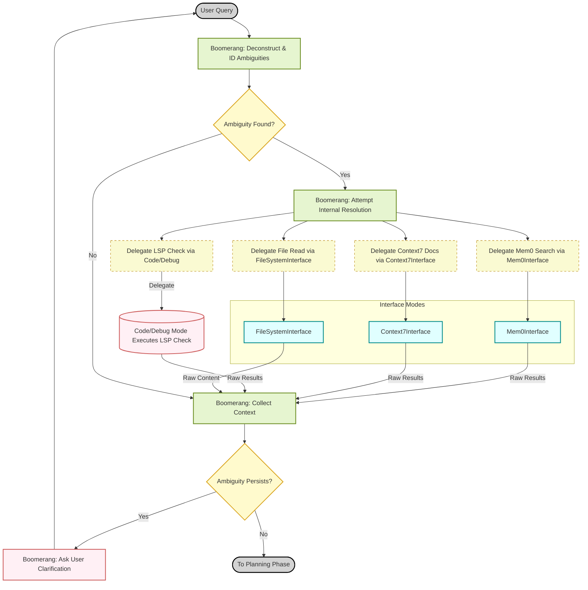
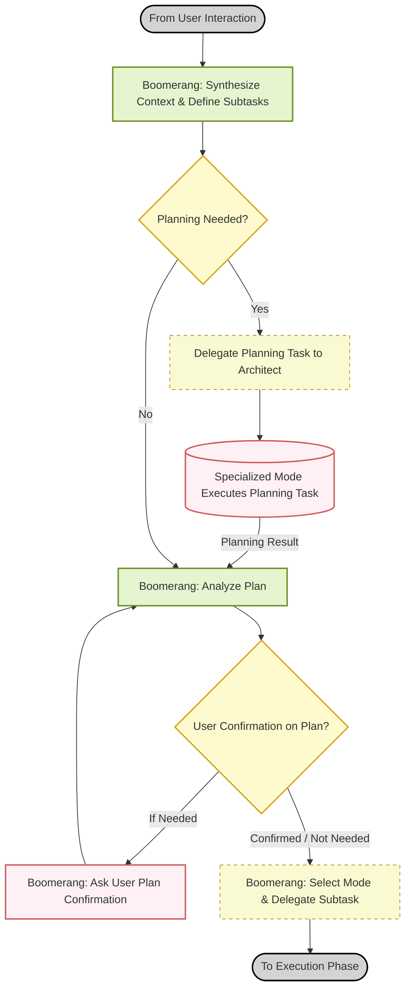
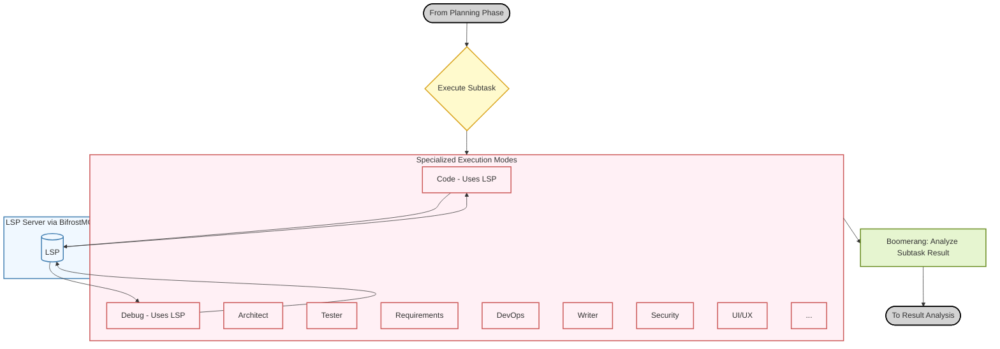
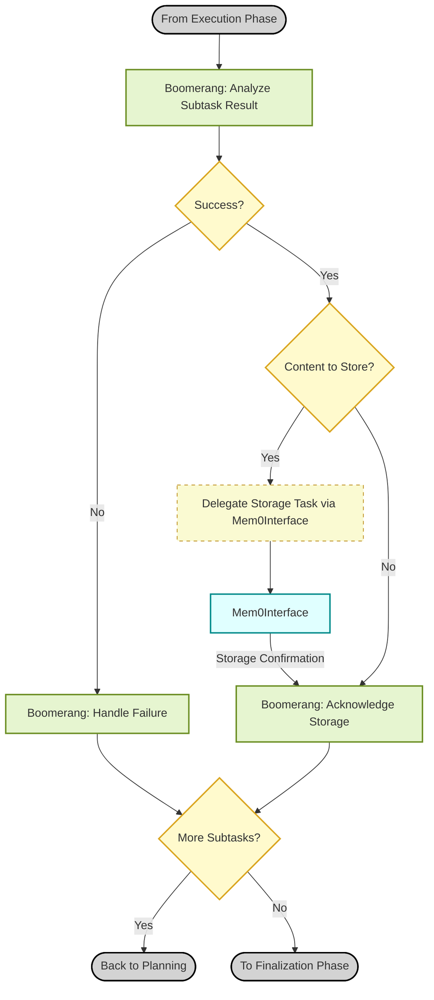
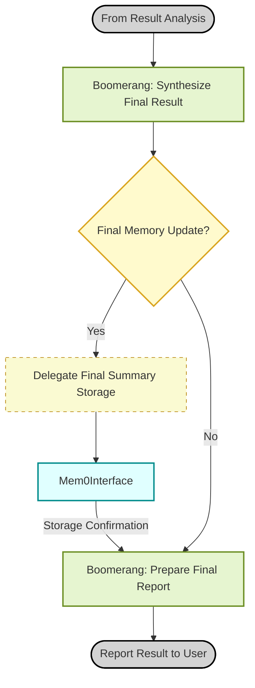
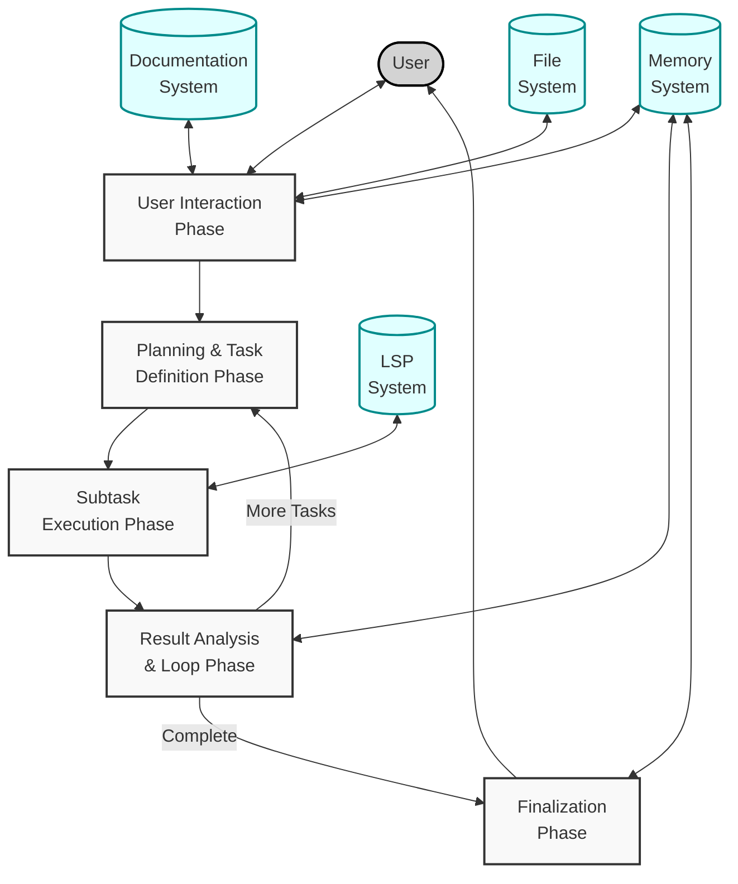

<p align="center">
  
</p>

# Dangeroo - Software Engineering Orchestrator

[](https://github.com/agentdesk/model-context-protocol)
[](https://github.com/mem0ai/mem0)
[](https://qdrant.tech/)
[](https://neo4j.com/)
[](https://fastapi.tiangolo.com/)

## Overview

**(Updated)**
🦘Dangeroo🤖 is an AI-powered multi-agent system designed to assist with complex software engineering tasks through sophisticated orchestration. It leverages a central coordinator, "Boomerang Mode", which directs a team of specialized AI "modes" handling different aspects of the software development lifecycle. Boomerang breaks down large requests into minimal, self-contained subtasks, orchestrates the gathering of necessary context from multiple sources (persistent memory, documentation, live code analysis), delegates execution to specialized modes, tracks progress, manages structured knowledge storage, and facilitates continuous improvement through best practice checks and conflict resolution.

The system is designed for robustness, traceability, and high-quality output by combining:

*   **Orchestration (`Boomerang Mode`):** Central coordination, task decomposition, context synthesis, and workflow management.
*   **Specialization:** Dedicated modes handle coding (`Code`), debugging (`Debug`), architecture (`Architect`), testing (`Tester`), requirements (`Requirements`), DevOps (`DevOps`), technical writing (`Writer`), security (`Security`), UI/UX (`UIUX`), and external system interactions.
*   **Atomicity:** Tasks are broken down into the smallest logical, independent units.
*   **Multi-Source Context:** Integrates information from:
    *   **Persistent Knowledge Memory (Mem0):** Accessed via `Mem0Interface` for semantic search, pattern retrieval, and storing structured knowledge with rich metadata (leveraging v2 features like filters).
    *   **External Documentation (Context7):** Accessed via `Context7Interface` for up-to-date API and library information.
    *   **Live Code Analysis (LSP via BifrostMCP):** Accessed directly by `Code` and `Debug` modes for real-time diagnostics, type info, references, and code actions.
    *   **Project Files (`.roo-docs/` & Source):** Accessed via `FileSystemInterface` for configuration, templates, logs, and literal file content.
*   **Advanced Prompting:** Techniques like Step-back, Chain-of-Thought (within modes or reporting), and Structured Outputs are orchestrated for clarity and reliability.
*   **Explicit Guardrails:** Specific instructions ensure modes handle failures, safety checks (including LSP-assisted cleanup), environmental factors, and best practice conflicts predictably.
*   **Best Practice Integration & Conflict Handling:** Explicitly incorporates project-defined best practices (`.roo-docs/bestPractices.md`) and includes a workflow for reviewing and potentially refactoring when conflicts arise.

## Core Concepts

### 1. Orchestration (`Boomerang Mode`)

**(Updated)**
Boomerang Mode acts as the central coordinator and strategic brain. It does not perform specific engineering tasks or directly use external tools (Mem0, Context7, LSP) itself. Instead, it focuses on:

*   **Task Decomposition:** Analyzing user requests and breaking them into atomic subtasks suitable for specialized modes.
*   **Context Orchestration:** Strategically delegating information-gathering tasks *before* execution delegation:
    *   To `Mem0Interface` for searching relevant patterns, history, and decisions using **advanced v2 filters** based on task type, components, category, etc.
    *   To `Context7Interface` for retrieving specific, up-to-date documentation.
    *   To `Code`/`Debug` for targeted initial LSP checks (e.g., `get_hover_info`) if needed for clarification.
    *   To `FileSystemInterface` for reading config, templates, or specific files.
*   **Context Synthesis:** Combining the gathered information (memory snippets, docs, LSP hints, file content) into a concise context package.
*   **Execution Delegation:** Selecting the appropriate specialized mode (`Code`, `Debug`, etc.) and delegating the atomic subtask via `new_task`, providing the **synthesized context** and precise instructions.
*   **Result Evaluation:** Analyzing the structured `attempt_completion` result from specialized modes (checking status, outcome, deliverables, metadata quality, conflict flags).
*   **Memory Storage Orchestration:** Receiving proposed memory content (`content_for_mem0`) and metadata (`metadata_for_mem0`) from execution modes and delegating the actual `add_memory` command (including options like `immutable` or `expiration_date`) to `Mem0Interface`.
*   **Workflow Control:** Managing the sequence of subtasks, handling failures, initiating clarification loops with the user (only after exhausting internal tools), orchestrating conflict reviews, and controlling conditional logging.
*   **Synthesis & Reporting:** Consolidating results upon goal completion and presenting the final outcome to the user.

### 2. Specialized Modes (Delegates & Interfaces)

**(Updated)**
The system utilizes several types of modes under Boomerang's direction:

*   **Execution Modes:** Focused on specific domains. They receive atomic tasks and **synthesized context** from Boomerang.
    *   `code` (💻 Code / LSP Enabled): Writes/modifies Python code, performs LSP checks (`get_diagnostics`, `find_references` etc.), implements cleanup.
    *   `debug` (🐞 Debug / LSP Enabled): Diagnoses issues using logs, context, and heavy LSP interaction (`get_diagnostics`, `find_references`, `go_to_definition`, etc.).
    *   `architect` (🏗️ Architect): Executes atomic design tasks (schemas, APIs).
    *   `tester` (🧪 Tester): Creates tests, data; analyzes results.
    *   `requirements` (📝 Requirements): Drafts, clarifies requirements.
    *   `devops` (⚙️ DevOps): Handles specific infrastructure/CI/CD tasks.
    *   `writer` (✍️ Technical Writer): Creates/updates documentation.
    *   `uiux` (🎨 UI/UX Designer): Provides conceptual UI/UX input.
    *   `security` (🔒 Security Analyst): Performs specific security reviews.
    *   **Output:** Report back concisely via `attempt_completion`, providing structured content (`content_for_mem0`) and rich metadata (`metadata_for_mem0`) suitable for storage in Mem0, and flagging best practice conflicts.
*   **Interface Modes (New):** Act as simple bridges to external MCP services, executing precise commands delegated by Boomerang.
    *   `mem0-interface` (🧠 Mem0 Interface): Handles all `add_memory`, `search_memory` calls, including advanced v2 parameters like `filters`.
    *   `context7-interface` (📚 Context7 Interface): Handles `resolve-library-id` and `get-library-docs`.
    *   **Output:** Return raw results from the MCP tool to Boomerang.
*   **Utility Modes:**
    *   `filesystem-interface` (📁 File System Interface / Renamed): Handles **literal file I/O** (read/write/append) on specific paths (config, templates, logs, reading source) as directed by Boomerang. *Does not handle knowledge memory.*
    *   `roo-logger` (📜 Roo Logger): Appends pre-formatted JSON log data to designated files.

### 3. Atom-of-Thought Principle

**(Unchanged)**
Every request is broken down into the smallest possible, logically independent steps. This allows for:
 *   **Manageability:** Reduces the complexity handled by any single mode instance.
 *   **Traceability:** Makes it easier to follow the workflow and pinpoint issues.
 *   **Parallelism:** Enables delegation of independent tasks simultaneously (platform permitting).
 *   **Reduced Error Propagation:** Limits the impact of a failure in one subtask.

### 4. Memory Systems: Knowledge vs. Files

**(Updated & Clarified)**
The system now utilizes two distinct forms of memory:

*   **Primary Knowledge Base (Mem0 via `Mem0Interface`):**
    *   **Purpose:** Central repository for project knowledge, patterns, decisions, code snippets, explanations, lessons learned, debug analyses, reflections.
    *   **Interaction:** Orchestrated exclusively by Boomerang via `Mem0Interface`.
    *   **Strengths:** Leverages **semantic search** and **advanced v2 filtering** based on rich, structured **metadata** (`type`, `category`, `components`, `language`, `keywords`, etc.) for highly relevant context retrieval. Enables storing granular, interconnected knowledge units.
*   **Project Artifacts & Configuration (`.roo-docs/` via `FileSystemInterface`):**
    *   **Purpose:** Stores literal file artifacts essential for project operation and context.
    *   **Interaction:** Orchestrated by Boomerang via `FileSystemInterface` for specific read/write/append tasks.
    *   **Content:**
        *   Configuration: `.roo-docs/.env` (e.g., `DEBUG_MODE`).
        *   Core Definitions: `.roo-docs/projectbrief.md`, `.roo-docs/techContext.md`, etc. (potentially read for context, less frequently updated).
        *   Standards: `.roo-docs/bestPractices.md`.
        *   Templates: `.roo-docs/templates/` (for structured logging/reporting).
        *   Logs: `.roo-docs/logs/` (managed by `RooLogger` or `FileSystemInterface`).
        *   *(Other project-specific files)*
    *   **Note:** This is *not* the primary searchable knowledge base for patterns or historical solutions; that role belongs to Mem0.

## Workflow Logic (Flowchart's)

**(Updated Intro Paragraph Only)**
The system workflow, orchestrated by Boomerang, involves several phases. It coordinates specialized execution modes (`Code`, `Debug`, etc.), interface modes (`Mem0Interface`, `Context7Interface`, `FileSystemInterface`) for external systems, and direct LSP interaction for code intelligence. The following diagrams illustrate this flow:

### System Overview

This high-level diagram shows how the five main phases connect and interact with external systems:

- The workflow begins with user interaction and proceeds through planning, execution, and result analysis
- A feedback loop exists between result analysis and planning for multi-task scenarios
- Each phase interacts with different external systems (Memory, Documentation, LSP, File System)
- The workflow ultimately returns results to the user

### 1. User Interaction and Ambiguity Resolution

This phase handles the initial processing of user queries:

- **Start**: The user submits a query
- **Ambiguity Detection**: Boomerang analyzes the query to identify ambiguities
- **Information Gathering**: If ambiguities exist, the system attempts to resolve them by:
  - Searching memory via Mem0Interface
  - Checking documentation via Context7Interface
  - Using LSP for code-related queries
  - Reading files via FileSystemInterface
- **Resolution Loop**: If ambiguities persist after gathering information, Boomerang asks the user for clarification
- **Transition**: Once all ambiguities are resolved, flow continues to the Planning phase

### 2. Planning and Subtask Definition

This phase covers how tasks are planned and broken down:

- **Context Synthesis**: Boomerang synthesizes all available context and defines subtasks
- **Planning Decision**: Determines if additional planning is needed
- **Specialized Planning**: If needed, delegates planning to the appropriate mode (like Architect)
- **Plan Analysis**: Analyzes the resulting plan
- **User Confirmation**: Optionally gets user confirmation on the plan
- **Task Delegation**: Selects the appropriate mode and delegates the execution subtask

### 3. Subtask Execution and LSP Integration

This phase shows how subtasks are executed and how code-related modes interact with LSP:

- **Execution Modes**: Showcases the variety of specialized execution modes available
- **LSP Integration**: Details how Code and Debug modes interact with LSP
- **Task Delegation**: Shows how tasks are delegated to the appropriate mode
- **Result Collection**: How results are collected and passed back to Boomerang

### 4. Result Analysis and Task Looping

This phase illustrates how results are processed and how the system handles task looping:

- **Result Analysis**: Boomerang analyzes the results from executed subtasks
- **Success Evaluation**: Determines if the subtask was successful
- **Failure Handling**: Processes failures (retry, ask user, abort)
- **Memory Storage**: Stores relevant content in memory via Mem0Interface
- **Subtask Loop**: Determines if more subtasks are needed, looping back to planning if necessary

### 5. Final Results and Memory Updates

This phase shows the final stage where results are synthesized and presented:

- **Final Synthesis**: Boomerang synthesizes the final results from all completed subtasks
- **Memory Update**: Optionally stores a comprehensive summary in memory
- **Final Report**: Prepares the final report for the user
- **Completion**: Reports results and reflections to the user

## Technical Implementation Notes

- The flowcharts use color-coding to distinguish different types of components:
  - Orchestration steps (green)
  - Decision points (yellow)
  - Interface operations (light blue)
  - Execution modes (light pink)
  - LSP interactions (blue)
  - Delegation actions (dashed yellow)
- Each phase connects with the subsequent phase through transition points
- The system implements recursive loops at multiple levels for refinement and multi-task handling
- Interface modes are consistently used to abstract system interactions

## Workflow Explanation (High-Level Summary)

**(Updated to reflect new roles)**
1.  Boomerang receives a user request, deconstructs it, and identifies ambiguities.
2.  Boomerang orchestrates context gathering by delegating tasks to `Mem0Interface`, `Context7Interface`, `Code`/`Debug` (for LSP), and `FileSystemInterface`.
3.  If ambiguities persist after tool use, Boomerang asks the user for clarification.
4.  Boomerang synthesizes the gathered context and defines atomic subtasks.
5.  Boomerang delegates planning tasks (if needed) to modes like `Architect`.
6.  Boomerang delegates execution subtasks (like coding or debugging) to the appropriate specialized mode, providing the synthesized context. Modes like `Code`/`Debug` use LSP directly during execution.
7.  The specialized mode executes its atomic task, performs safety checks (like using LSP `find_references` before cleanup), and reports concise results (including content/metadata for memory and conflict flags) via `attempt_completion`.
8.  Boomerang analyzes the result, handles failures, orchestrates conflict review/refactoring if needed, and delegates memory storage via `Mem0Interface` (using advanced parameters like `immutable`).
9.  Boomerang checks if conditional logging is needed (via `FileSystemInterface` check of `.env`) and orchestrates it using the original mode and `RooLogger` (or `FileSystemInterface`).
10. Boomerang loops back to delegate the next subtask or proceeds to final synthesis if the goal is complete.
11. Boomerang reports the final synthesized outcome to the user.

## Advanced Prompting Techniques (Refined for Orchestration)

Boomerang orchestrator leverages several techniques, often by instructing specialized modes, to improve the quality and reliability of the workflow:

*   **Step-back Prompting:** Used by **Boomerang** for initial ambiguity resolution or planning adjustment **before** committing to **execution** delegation. **After attempting internal context gathering via interface modes (Mem0, Context7, LSP, FileSystem),** Boomerang assesses if clarity is sufficient. If not, it steps back to ask the user clarifying questions via `ask_followup_question`, ensuring a clearer path forward before proceeding with subtask delegation.
    ```mermaid
    flowchart LR
        A["Ambiguous User Request"] --> B["Boomerang Gathers Initial Context (via Delegation)"]
        B --> B2{Ambiguity Persists?}
        B2 -- Yes --> C["Boomerang Steps Back (Ask User)"]
        C -->|"Clarification"| B1["Re-evaluate Path"]

        B2 -- No --> D["Clear Path Forward (Proceed to Planning/Delegation)"]


        classDef default fill:#f9f9f9,stroke:#333,stroke-width:1px,color:#333
        classDef focus fill:#d4e6f1,stroke:#2874a6,stroke-width:2px,color:#000

        class B,B2,C focus
    ```
*   **Chain-of-Thought (CoT):** May be requested by **Boomerang** *from* specialized modes. Boomerang instructs the mode (via `new_task`) to include concise reasoning steps **within its structured result (`content_for_mem0` or `core_outcome`)**. This is particularly useful for complex tasks where understanding the mode's reasoning is important for validation or debugging. More extensive CoT is typically requested as part of the detailed reporting task (when `DEBUG_MODE` is on).
    ```mermaid
    flowchart LR
        A["Complex Task"] --> B["Boomerang Instructs Mode (via new_task) to Include CoT"]
        B --> C["Specialized Mode Execution"]
        C --> D["Mode Includes Reasoning in attempt_completion Payload (content_for_mem0 / core_outcome)"]
        D --> E["Boomerang Receives Transparent Result"]


        classDef default fill:#f9f9f9,stroke:#333,stroke-width:1px,color:#333
        classDef focus fill:#d4e6f1,stroke:#2874a6,stroke-width:2px,color:#000
        classDef reasoning fill:#d5f5e3,stroke:#1e8449,stroke-width:2px,color:#000

        class B focus
        class D reasoning
    ```
*   **Self-Consistency:** For critical tasks, **Boomerang** might instruct a specialized mode (via `new_task`) to generate multiple distinct outputs (e.g., alternative code solutions, different design options). The mode returns these variations within its `attempt_completion` result. **Boomerang** then analyzes these results for consistency, correctness, or to select the best option before proceeding.
    ```mermaid
    flowchart TD
        A["Critical Task"] --> B["Boomerang Instructs Mode (via new_task) to Generate Multiple Solutions"]

        B --> C["Specialized Mode Generates Solutions"]

        C --> D["Mode Returns Solutions A, B, C in attempt_completion"]

        D --> E["Boomerang Analyzes Consistency\n(Receives & Evaluates Mode's Output)"]


        E --> F["Final Validated Result/Decision by Boomerang"]

        classDef default fill:#f9f9f9,stroke:#333,stroke-width:1px,color:#333
        classDef focus fill:#d4e6f1,stroke:#2874a6,stroke-width:2px,color:#000
        classDef solution fill:#d5f5e3,stroke:#1e8449,stroke-width:1px,color:#000
        classDef result fill:#ebdef0,stroke:#8e44ad,stroke-width:2px,color:#000

        class B,E focus
        class C solution
        class D,F result
    ```

*   **Structured Outputs:** Boomerang mandates **from the specialized modes** that `attempt_completion` results use specific JSON keys (`status`, `core_outcome`, `deliverables`, `content_for_mem0`, `metadata_for_mem0`, `conflict_flag`). Boomerang also uses JSON templates when orchestrating the **secondary, detailed reporting task** (if `DEBUG_MODE` is on) involving the original mode and `RooLogger`. This ensures results are consistently structured for reliable parsing, workflow decisions, memory storage, and logging.
    ```mermaid
    flowchart LR
        A["Need for Reliable Data Flow"] --> B["Boomerang Mandates Structure (via new_task instructions)"]

        B --> C["Mode Returns Structured attempt_completion Result"]
        B --"If DEBUG_MODE=TRUE\n(Secondary Task)"--> D["Mode Fills JSON Template\nfor Detailed Reporting"]


        C --> F["Input for Immediate Workflow Decision & Mem0 Storage"]
        D --> G["Input for Logging (via RooLogger)\n& Deep Analysis"]

        classDef default fill:#f9f9f9,stroke:#333,stroke-width:1px,color:#333
        classDef focus fill:#d4e6f1,stroke:#2874a6,stroke-width:2px,color:#000
        classDef format fill:#fdebd0,stroke:#d35400,stroke-width:1px,color:#000

        class B focus
        class C,D format
    ```

**Important Note:** Specialized modes focus on their primary atomic task and generating the required structured output (including concise results, memory content/metadata, and conflict flags). They only perform detailed template filling or extensive CoT when explicitly given a secondary reporting task by Dangeroo Mode.

## Explicit Guardrails & Failure Handling (Updated)

To address potentially critical issues arising from implicit assumptions, specific instructions have been added to the specialized modes:

*   **Failure Reporting:** Modes **MUST** use `attempt_completion` to report failure if they encounter an insurmountable error during execution, providing clear details in a structured format (JSON).
*   **Tool Safety Check:** Relevant modes **MUST** pause and request confirmation via `ask_followup_question` before executing potentially destructive/costly tool commands.
*   **Environment Awareness:** Modes report missing requirements rather than attempting setup.
*   **Idempotency & Side Effects:** Relevant modes are encouraged to strive for idempotency and minimize side effects, noting risks in summaries/reports.
*   **Best Practice Adherence & Conflict Flagging:** **(New/Enhanced)** Relevant modes (`Code`, `Architect`, `Tester`, `DevOps`, `Security`, `Writer`, `Requirements`) **MUST** consider referenced best practices (`.roo-docs/bestPractices.md`) alongside existing context. If a significant conflict arises, they **MUST** flag this conflict briefly in their concise `attempt_completion` summary to enable the orchestrator's review process.

These explicit instructions act as crucial guardrails, making the system's behavior more predictable, robust, and safe, now also including a mechanism for quality improvement by addressing best practice deviations.

## Conflict Review & Refactoring Process (New Section)

A key enhancement is the system's ability to handle conflicts between requested tasks/existing patterns and defined best practices:
1.  **Flagging:** Specialized modes identify and flag significant conflicts in their concise `attempt_completion` result.
2.  **Evaluation:** Dangeroo Mode evaluates the flagged conflict. Based on severity, project context, or user configuration, it decides if immediate review is needed.
3.  **Review Delegation:** If review is warranted, Dangeroo delegates a specific task to an appropriate mode (e.g., `Architect`, senior `Code`) to analyze the conflict and recommend action (e.g., Refactor Now, Log Tech Debt, Maintain Consistency).
4.  **Decision & Action:** Dangeroo evaluates the recommendation and delegates the chosen action:
    *   **Refactor:** A new primary task is delegated to `Code` mode.
    *   **Log Debt:** `MemoryKeeper` updates `progress.md` or a dedicated log.
    *   **Maintain:** Workflow continues, possibly with a note in `activeContext.md`.
This loop allows the system to avoid blindly replicating suboptimal patterns and facilitates gradual code quality improvement, orchestrated by Dangeroo Mode.

## Usage

Interaction typically happens with Dangeroo Mode. The user provides a high-level goal or task (e.g., "Implement user authentication using JWT", "Refactor the database access layer", "Add unit tests for the payment module"). Dangeroo Mode then handles the entire process of breaking down the task, orchestrating the specialized modes, managing context, and reporting the final outcome. The user may be consulted via ask_followup_question if clarification is needed or if a safety check requires confirmation.

.roomodes.initialise is a prototype prompt with the intended purpose of using this with your LLM model of choice to 'initialise' context for the RooCode system. It is not a complete prompt and should be used as a starting point for your own implementation. The prompt is designed to be used with the RooCode system and should be modified to suit your specific needs.

I have been testing using :

```prompt
Create a whimsical, Ghibli-inspired LLM-powered web chat application that exudes the gentle, enchanting aesthetic of Studio Ghibli films. Keep the interface minimalist yet visually captivating, with pastel color schemes, subtle animations, and charming background illustrations. Implement an interactive chat window that seamlessly displays user messages alongside an AI assistant avatar styled as a friendly forest spirit. Infuse delight at every turn with playful hover effects, smooth transitions, and a cozy branding feel. Ensure the user experience is intuitive and magical, inviting visitors to explore an immersive environment that combines simple functionality with the timeless wonder of Ghibli storytelling.
```
<p align="center">
  
</p>

## Structured Logging Templates

JSON templates for successful task completion and issue reporting are stored in `.roo-docs/templates/`. These are filled by the original specialized mode during the secondary reporting task (if `DEBUG_MODE` is enabled) and then passed to `roo-logger` for persistence in `.roo-docs/logs/`. This provides detailed, structured data for observability and future analysis.

## `.roomodes.initialise` (Note)

The `.roomodes.initialise` prompt mentioned previously serves as a conceptual starting point for bootstrapping the *initial content* of the `.roo-docs/` memory bank by analyzing an existing codebase. It would need to be adapted and executed (likely via Dangeroo Mode delegating analysis tasks) when starting work on a pre-existing project.

## Updates 21/04/2025 - Shift to Orchestration & Enhanced Tooling

This update represents a major architectural refactoring from a single comprehensive agent to a multi-agent orchestration system ("Dangeroo") coordinated by `Boomerang Mode`, incorporating enhanced tool integration and knowledge management strategies. Key changes include:

*   **Core Architectural Shift: Multi-Agent Orchestration:** System redesigned around `Boomerang Mode` orchestrating specialized modes (`Code`, `Debug`, `Architect`, `Tester`, etc.). This improves modularity, focuses expertise, and helps manage context window limitations.
*   **Dedicated Interface Modes:** Introduced `Mem0Interface` and `Context7Interface`. These modes act as simple, dedicated bridges, centralizing interactions with the Mem0 (memory) and Context7 (documentation) MCP servers, respectively. Boomerang delegates all calls to these external services through these interfaces.
*   **Refined File System Handling:** `Memory Keeper` mode has been refocused and renamed to `FileSystemInterface`. Its role is strictly limited to literal file I/O operations (reading/writing config, templates, logs) as directed by Boomerang, separating it clearly from the semantic knowledge stored in Mem0.
*   **LSP Integration (via BifrostMCP):** Real-time code intelligence is now integrated. The `Code` and `Debug` modes have been granted direct access to the LSP server via BifrostMCP and are instructed to use critical LSP calls (`get_diagnostics`, `find_references`, `get_hover_info`, `get_code_actions`) to enhance analysis, ensure code quality, and perform safer refactoring/cleanup.
*   **Advanced Mem0 v2 Utilization:** `Boomerang` now orchestrates `Mem0Interface` to leverage powerful Mem0 v2 features. This includes using structured `filters` for targeted semantic searches and applying metadata options like `immutable` (for critical decisions/patterns) and `expiration_date` (for temporary context) during memory storage.
*   **Orchestrated Memory Storage:** The process for storing knowledge is refined. Execution modes generate structured content (`content_for_mem0`) and rich metadata (`metadata_for_mem0`), which `Boomerang` then explicitly delegates to `Mem0Interface` for the actual `add_memory` operation. Emphasis is placed on generating comprehensive metadata (especially `components`) to enable effective filtering.
*   **Enhanced Clarification Protocol ("Exhaust Tools First"):** The ambiguity resolution process mandates attempting internal resolution using all available tools (Memory search, Documentation lookup, LSP checks via `Code`/`Debug`, File reads via `FileSystemInterface`) *before* resorting to asking the user for clarification.
*   **LSP-Powered Cleanup:** The mandatory cleanup/refactoring step within `Code` and `Debug` modes now explicitly requires using LSP `find_references` to verify code usage *before* suggesting removal or commenting out, enhancing safety.
*   **Reflection Persistence:** Added an explicit step for `Boomerang` to orchestrate the storage of generated "Reflection" outputs (when errors or significant corrections occur) into Mem0 via `Mem0Interface`, tagged with `type: 'reflection'`.

These changes aim to create a more robust, scalable, and intelligent system that effectively leverages specialized agents and advanced tooling (Memory, Docs, LSP) under strategic coordination.

## Updates 12/04/2025

Generic LLMs lack deep familiarity with a specific project's unique coding style, architectural patterns, or testing conventions. Providing only high-level context might lead to generic or inconsistent outputs requiring correction cycles.

*   **Best Practice Integration:** Introduced `.roo-docs/bestPractices.md`. Specialized modes are now instructed to adhere to referenced best practices and explicitly flag conflicts with existing patterns in their concise results.
*   **Conflict Review/Refactor Loop:** Dangeroo Mode workflow updated to conditionally trigger a review and potential refactoring sub-process when best practice conflicts are flagged by modes.
*   **Corrected DEBUG_MODE Check:** Dangeroo Mode now correctly delegates a check for `DEBUG_MODE` status immediately before the conditional logging decision (Step 4C), preventing the use of stale values.
*   **Standardized JSON Results:** Specialized modes instructed to use a minimal JSON structure (`{"status": ..., "core_outcome": ..., "deliverables": ..., "conflict_flag": ...}`) for their concise `attempt_completion` results, improving reliability for the orchestrator.
*   **Enhanced Contextualization:** Added dynamic persona injection based on memory bank context and suggested few-shot examples for improved mode accuracy (implementation detail within Boomerang's prompt formulation).
*   **Limited Internal Retry:** Suggested allowing modes a single internal retry for simple, verifiable errors (implementation detail within mode instructions).
*   **README & Flowchart:** Documentation updated to reflect these significant process enhancements (Flowchart requires manual update with provided code).

When you want to update backend-services, run the following command in the root directory of the project:

```bash 
git submodule update --remote server