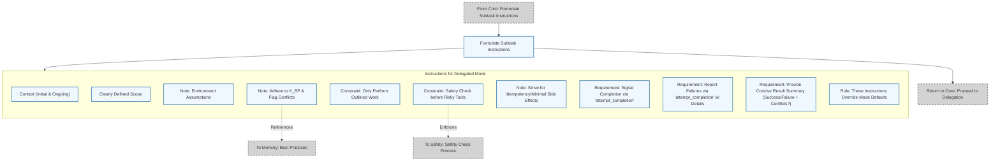
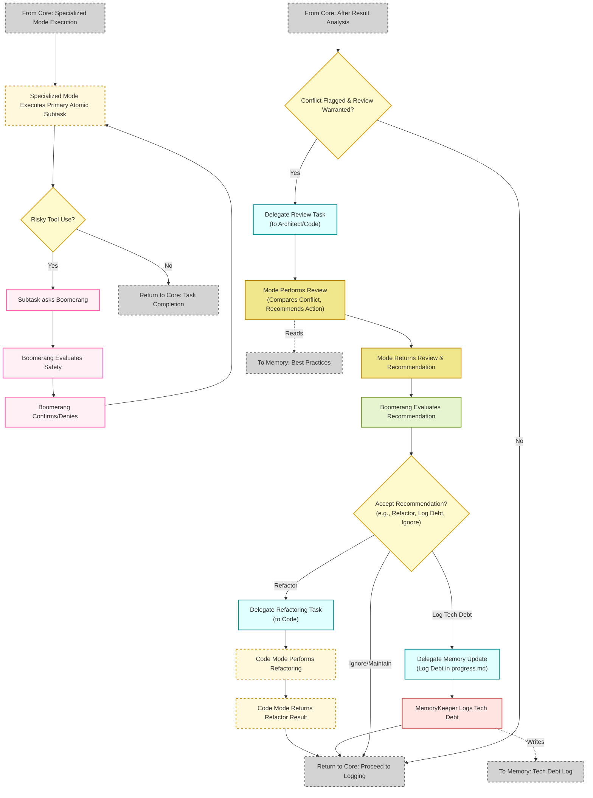
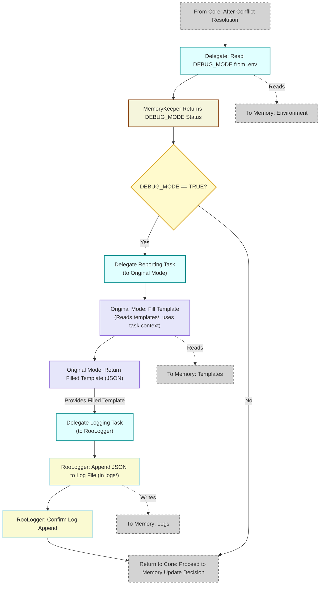

<p align="center">
  
</p>

# Dangeroo Mode - (Boomerang) Software Engineering Orchestrator

## Overview

🦘Dangeroo Mode🤖 is an AI-powered system designed to assist with complex software engineering tasks. It operates through a sophisticated orchestration pattern, leveraging specialized AI "modes" to handle different aspects of the software development lifecycle. The central orchestrator, known as "Dangeroo Mode" (internally using Boomerang Mode in RooCode), breaks down large requests into minimal, self-contained subtasks, delegates them to the appropriate specialized mode, tracks progress, manages project context using a persistent memory bank, implements conditional structured logging, and facilitates continuous improvement through best practice checks and conflict resolution.

The system is designed for robustness, traceability, and high-quality output by combining:
*   **Specialization:** Different modes handle coding, architecture, testing, logging, etc.
*   **Atomicity:** Tasks are broken down into the smallest logical units.
*   **Statefulness:** A structured memory bank (`.roo-docs/`) maintains context, configuration, templates, logs, and **best practices** across sessions.
*   **Advanced Prompting:** Techniques like Step-back, Chain-of-Thought, Self-Consistency, and Structured Outputs are used for clarity and reliability.
*   **Explicit Guardrails:** Specific instructions ensure modes handle failures, safety, environmental factors, and **best practice conflicts** predictably.
*   **Conditional Structured Logging:** Detailed task success/failure information is logged in a structured format (using templates) when `DEBUG_MODE` is enabled.
*   **Best Practice Integration & Conflict Handling:** Explicitly incorporates project-defined best practices and includes a workflow for reviewing and potentially refactoring when conflicts arise between existing patterns and desired standards.

## Core Concepts

### 1. Orchestration (Dangeroo Mode / Boomerang Mode)
Dangeroo Mode acts as the central coordinator. It does not perform specific engineering tasks itself but instead focuses on:
*   **Initial Context Loading:** Delegating to `MemoryKeeper` to load initial state, configuration (including `DEBUG_MODE`), and **relevant best practices** from `.roo-docs/`.
*   **Task Decomposition:** Applying an "atom-of-thought" approach and evaluating the breakdown for true minimality.
*   **Mode Selection:** Choosing the best specialized mode for each primary subtask.
*   **Instruction Formulation:** Providing detailed, context-rich instructions for primary delegations, **including references to applicable best practices**.
*   **Advanced Prompting:** Utilizing techniques strategically during primary task delegation.
*   **Result Evaluation:** Analyzing the concise `attempt_completion` result from specialized modes to determine success or failure **and check for any flagged best practice conflicts**.
*   **Conflict Resolution (Conditional):** If a significant conflict is flagged by a mode, initiating a review sub-flow (delegating review, evaluating recommendations, potentially delegating refactoring or logging tech debt).
*   **Conditional Logging Orchestration:**
    *   Checking if `DEBUG_MODE` is enabled (by **delegating a read** to `MemoryKeeper` *at the time of decision*).
    *   If enabled, orchestrating the two-stage logging process: delegate detailed report generation to the original mode, then delegate log persistence to `roo-logger`.
*   **State Management & Workflow Control:** Deciding the next primary workflow step based on the *core* subtask outcome (potentially after conflict resolution), e.g., delegate next task, delegate debugging, ask user, delegate core memory updates, synthesize.
*   **Synthesis:** Consolidating results upon goal completion and triggering final memory updates, including potential updates to best practice documentation if refined during the process.

### 2. Specialized Modes (Delegates)
Each specialized mode is an AI assistant focused on a specific domain, operating strictly under Dangeroo Mode's direction:
*   **`code` (💻 Code):** Writes, modifies, and explains code.
*   **`architect` (🏗️ Architect):** Executes atomic design tasks.
*   **`ask` (❓ Ask):** Answers specific technical questions.
*   **`debug` (🐞 Debug):** Performs specific debugging tasks.
*   **`requirements` (📝 Requirements):** Drafts, clarifies, and documents requirements.
*   **`tester` (🧪 Tester):** Writes tests, generates test data, analyzes results.
*   **`devops` (⚙️ DevOps):** Handles specific CI/CD, infrastructure, build, and deployment tasks.
*   **`writer` (✍️ Technical Writer):** Creates and updates documentation.
*   **`uiux` (🎨 UI/UX Designer):** Provides conceptual UI/UX input.
*   **`security` (🔒 Security Analyst):** Performs specific security reviews.
*   **`memorykeeper` (💾 Memory Keeper):** Executes precise read/write operations on the memory bank files (core context, `.env`, templates).
*   **`roo-logger` (📜 Roo Logger):** Receives pre-formatted JSON log data and appends it to the designated log file(s) (within `.roo-docs/logs/`).

Modes execute their assigned *primary* task and report back *concisely* via `attempt_completion`, **now including a flag if a conflict with best practices was detected**. If `DEBUG_MODE` is on, the mode that performed the primary task (or a subsequent refactoring task) may receive a *secondary* task to provide detailed structured reporting by filling a JSON template. They are also responsible for adhering to best practices referenced in their instructions.

### 3. Atom-of-Thought Principle
Every request is broken down into the smallest possible, logically independent steps. This allows for:
 *   **Manageability:** Reduces the complexity handled by any single mode instance.
 *   **Traceability:** Makes it easier to follow the workflow and pinpoint issues.
 *   **Parallelism:** Enables delegation of independent tasks simultaneously (platform permitting).
 *   **Reduced Error Propagation:** Limits the impact of a failure in one subtask.

### 4. Memory Bank (`.roo-docs/`)
This directory structure is the cornerstone of Roo's statefulness.
*   **Persistence:** Stores project context, decisions, progress, history, configuration, templates, detailed logs, and **project-defined best practices**.
*   **Structure:** Organized into key files and directories:
    *   `.roo-docs/projectbrief.md`
    *   `.roo-docs/productContext.md`
    *   `.roo-docs/systemPatterns.md`
    *   `.roo-docs/techContext.md`
    *   `.roo-docs/activeContext.md`
    *   `.roo-docs/progress.md`
    *   `.roo-docs/bestPractices.md`: **(New)** Project-specific conventions, style guides, desired patterns, security guidelines.
    *   `.roo-docs/.env`: Configuration variables (e.g., `DEBUG_MODE=TRUE`).
    *   `.roo-docs/templates/`: JSON templates (`task_completion_template.json`, `issue_report_template.json`).
    *   `.roo-docs/logs/`: Structured log files (e.g., `activity.log`).
    *   *(Other files/folders as needed)*
*   **Usage:** Dangeroo Mode orchestrates interactions via `MemoryKeeper` (for core files, `.env`, templates, `bestPractices.md`) and `roo-logger` (for `logs/`). The memory bank provides context for decision-making, defines desired quality standards, and stores detailed operational history when debugging is enabled.

## Workflow Logic (Flowchart's)

### Diagram Structure
Due to the complexity of the system, the architecture is represented across five interconnected diagrams:

1. **Core Overview Diagram**: Illustrates the main process flow from user request to completion
2. **Memory Bank Detail Diagram**: Shows the memory structure and how different processes interact with it
3. **Subtask Instruction Detail Diagram**: Details how subtask instructions are formulated and structured
4. **Safety & Conflict Resolution Diagram**: Demonstrates safety check processes and conflict handling
5. **Logging & Reporting Diagram**: Shows the conditional debugging and logging capabilities

The following diagram illustrates the updated interaction flow, including the two-stage conditional logging process:

```mermaid
flowchart TD
    %% Core Overview Diagram - Main flow without detailed subprocesses
    
    A["Start | Receive User Request"] --> B_delegate[Delegate Initial Memory Review/Setup Task]
    B_delegate --> B["Memory Setup (See Memory Bank Diagram)"]
    B -- Provides Initial Context --> C["Atom-of-Thought Breakdown & Evaluation"]

    C --> D[Select Appropriate Specialized Mode]
    D --> J[Formulate Subtask Instructions]
    
    J --> J_details["(See Instructions Detail Diagram)"]
    J --> D_delegate[Delegate Subtask via 'new_task' Tool]

    D_delegate --> S[Specialized Mode Executes Primary Atomic Subtask]
    S --> S_check{"Safety Check\n(See Safety & Conflict Resolution Diagram)"}
    S_check --> S_comp["Subtask Signals Completion ('attempt_completion')"]
    S_comp --> S_res["Subtask Provides Concise Result Summary"]
    S_res --> E["Boomerang: Monitor & Analyze Result"]
    
    E --> E_conflict["Conflict Resolution\n(See Safety & Conflict Resolution Diagram)"]
    E_conflict --> E_log["Conditional Logging\n(See Logging & Reporting Diagram)"]
    
    E_log --> F{"Significant Result/State Change\nRequiring Immediate Memory Update?"}
    F -- Yes --> I_delegate[Delegate Core Memory Update Task]
    I_delegate --> I_exec["MemoryKeeper Updates Core Files"]
    I_exec --> G

    F -- No --> G

    G{All Subtasks for Current Goal/Phase Completed?}
    G -- No --> C
    G -- Yes --> H[Boomerang: Synthesize Results for Completed Goal]
    H --> I_final_delegate[Delegate Final/Comprehensive Memory Update Task]
    I_final_delegate --> I_final_exec[MemoryKeeper Performs Comprehensive Update]
    I_final_exec --> Z["Goal Complete | Report Synthesis to User | Await Next Major Task"]

    %% Styling
    classDef process fill:#e6f5d0,stroke:#6b8e23,stroke-width:2px
    classDef decision fill:#fffacd,stroke:#daa520,stroke-width:2px
    classDef memory fill:#ffe4e1,stroke:#cd5c5c,stroke-width:2px
    classDef instruction fill:#f0f8ff,stroke:#4682b4,stroke-width:2px
    classDef subtask fill:#fff8dc,stroke:#b8860b,stroke-width:2px,stroke-dasharray:5 5
    classDef delegate fill:#e0ffff,stroke:#008b8b,stroke-width:2px
    classDef connector fill:#d3d3d3,stroke:#696969,stroke-width:2px,stroke-dasharray:5 5
    
    class A,C,D,E,H,Z process
    class F,G,S_check decision
    class B memory
    class J instruction
    class S,S_comp,S_res subtask
    class D_delegate,I_delegate,I_final_delegate,B_delegate delegate
    class J_details,E_conflict,E_log connector
```


### Key Components

#### Memory Bank
The system maintains a structured memory bank containing critical files:

* Core files (projectbrief.md, productContext.md, systemPatterns.md, etc.)
* Environment configuration (.env)
* Logs directory (logs/)
* Templates directory (templates/)
* Best practices (bestPractices.md)

```mermaid
flowchart TD
    %% Memory Bank Detail Diagram
    
    %% Connection from Core Diagram
    B_ref[From Core: Memory Setup] --> B_exec
    
    subgraph ProjectMemoryBank [Memory Bank - Single Source of Truth]
        direction LR
        K1[projectbrief.md]
        K2[productContext.md]
        K3[systemPatterns.md]
        K4[techContext.md]
        K5[activeContext.md]
        K6[progress.md]
        K_Env[.env]
        K_Logs[logs/]
        K_Tmpl[templates/]
        K_BP[bestPractices.md]
        K_Other[...]
    end

    B_exec["MemoryKeeper: Read Context / Create Files"] -- "Read/Write" --> ProjectMemoryBank
    B_exec --> B_res["MemoryKeeper: Return Context / Confirm Setup"]
    B_res --> B_return[Return to Core: Initial Context Provided]
    
    %% Other connections to memory
    Core_Update[From Core: Memory Updates] --> I_exec["MemoryKeeper Updates Core File(s) (K1-K6)"]
    I_exec -- "Updates" --> ProjectMemoryBank
    I_exec --> Return_Core[Return to Core]
    
    Core_Final[From Core: Final Memory Update] --> I_final_exec["MemoryKeeper Performs Comprehensive Update"]
    I_final_exec -- "Updates" --> ProjectMemoryBank
    I_final_exec --> Return_Core_Final[Return to Core]
    
    %% Connections from other diagrams
    Log_Write[From Logging: Write Logs] -- "Writes" --> K_Logs
    Template_Read[From Logging: Read Templates] -- "Reads" --> K_Tmpl
    BP_Read[From Safety: Read Best Practices] -- "Reads" --> K_BP
    Env_Read[From Logging: Read Environment] -- "Reads" --> K_Env
    Progress_Write[From Safety: Write Tech Debt] -- "Writes" --> K6

    %% Styling
    classDef process fill:#e6f5d0,stroke:#6b8e23,stroke-width:2px
    classDef memory fill:#ffe4e1,stroke:#cd5c5c,stroke-width:2px
    classDef connector fill:#d3d3d3,stroke:#696969,stroke-width:2px,stroke-dasharray:5 5
    classDef initial_mem fill:#f5f5dc,stroke:#8b4513,stroke-width:2px
    
    class K1,K2,K3,K4,K5,K6,K_Env,K_Logs,K_Tmpl,K_BP,K_Other memory
    class I_exec,I_final_exec memory
    class B_ref,Core_Update,Core_Final,Log_Write,Template_Read,BP_Read,Env_Read,Progress_Write,B_return,Return_Core,Return_Core_Final connector
    class B_exec,B_res initial_mem
``` 



#### Process Flow

* User requests are received and broken down into atomic subtasks
* Appropriate specialized modes are selected for each subtask
* Tasks are delegated with clear instructions and constraints
* Safety checks occur before risky operations
* Results are analyzed and conflicts are addressed through a review process
* Conditional logging occurs based on debug settings
* Memory is updated either incrementally or comprehensively

#### Subtask Instruction Detail
Displays the detailed instruction structure used when delegating tasks to specialized modes.

#### Safety & Conflict Resolution
Details both the safety check loop for risky operations and the conflict resolution process.


#### Logging & Reporting
Shows the conditional logging process based on debug settings.


## Workflow Explanation (Updated)
1.  Dangeroo Mode initiates context loading via `MemoryKeeper`, including **best practices** and `.env` (`B_delegate` -> `B_res`).
2.  It breaks down the user request (`C`), ensuring atomicity.
3.  It delegates the primary subtask (`D_delegate`) to a specialized mode (`S`), **referencing best practices**.
4.  **Safety Check:** The mode checks for risky operations (`S_check`) and requests confirmation if needed.
5.  **Completion:** The mode completes the primary task, reporting a *concise* success/failure summary **including any conflict flags** (`S_comp` -> `S_res`).
6.  **Evaluation & Conflict Handling:** Dangeroo analyzes the concise result (`E`). If a conflict is flagged and review is warranted, it initiates a **Review/Refactor sub-flow** (`E_conflict_check` block): delegating review, evaluating the recommendation, and potentially delegating refactoring or logging tech debt. The flow then proceeds based on the *effective* outcome (original or refactored).
7.  **Conditional Logging:**
    *   Dangeroo **delegates a check** for the *current* `DEBUG_MODE` status (`E_checkEnv`).
    *   If TRUE, it orchestrates the two-stage logging: delegates detailed report generation to the originating mode (`L_delegate_report` -> `L_report_res`), then delegates log persistence to `roo-logger` (`L_delegate_log` -> `L_res`).
8.  **Core Workflow Continuation:** The flow proceeds to decision point `F`, based on the *effective concise result* from step 5 (or the result of a refactor from step 6).
9.  **Core Memory Update:** Dangeroo decides if an *immediate* update to core memory files is needed (`F`) and delegates if required.
10. **Next Step Decision:** Dangeroo determines the next primary action (`G`) - loop back to breakdown (`C`), synthesize (`H`), etc.
11. **Finalization:** Synthesize results (`H`), delegate final comprehensive core memory updates (`I_final_delegate` -> `I_final_exec`), and report to the user (`Z`).

## Advanced Prompting Techniques (Includes minor clarification)

Dangeroo Mode employs several techniques to improve the quality and reliability of the workflow:

-   **Step-back Prompting:** Used by Dangeroo Mode when a user request is ambiguous or a path forward isn't clear. It involves asking clarifying questions or exploring options *before* delegating subtasks.
    ```mermaid
    flowchart LR
        A["Ambiguous User Request"] --> B["Dangeroo Mode Steps Back"]
        B --> C["Clear Path Forward"]
        B --> D["Ask Clarifying Questions"]
        D -->|"Clarification"| B

        classDef default fill:#f9f9f9,stroke:#333,stroke-width:1px,color:#333
        classDef focus fill:#d4e6f1,stroke:#2874a6,stroke-width:2px,color:#000

        class B focus
    ```
-   **Chain-of-Thought (CoT):** Dangeroo Mode may explicitly request specialized modes to include concise reasoning steps in their *concise* result summary or, more likely, request it as part of the *detailed reporting task* (when `DEBUG_MODE` is on). This aids transparency and debugging. CoT results may be stored in the memory bank or the detailed logs.
    ```mermaid
    flowchart LR
        A["Complex Task"] --> B["Dangeroo Mode Requests CoT (in primary or reporting task)"]
        B --> C["Specialized Mode Execution"]
        C --> D["Transparent Result/Report"]

        C --> E["Include reasoning steps\nin summary/template"]
        E --> B

        classDef default fill:#f9f9f9,stroke:#333,stroke-width:1px,color:#333
        classDef focus fill:#d4e6f1,stroke:#2874a6,stroke-width:2px,color:#000
        classDef reasoning fill:#d5f5e3,stroke:#1e8449,stroke-width:2px,color:#000

        class B focus
        class E reasoning
    ```
-   **Self-Consistency:** For critical or error-prone subtasks, Dangeroo Mode may ask a mode to generate multiple distinct solutions/outputs during the *primary* task. Dangeroo Mode then analyzes these for consistency or correctness *before* proceeding (Step `E` in main flowchart). Validation outcomes can be stored in the memory bank or logs.
    ```mermaid
    flowchart TD
        A["Critical Task"] --> B["Dangeroo Mode Requests Multiple Solutions"]

        B --> C["Solution A"]
        B --> D["Solution B"]
        B --> E["Solution C"]

        C --> F["Dangeroo Mode Analyzes Consistency (Step E)"]
        D --> F
        E --> F

        F --> G["Final Validated Result/Decision"]

        classDef default fill:#f9f9f9,stroke:#333,stroke-width:1px,color:#333
        classDef focus fill:#d4e6f1,stroke:#2874a6,stroke-width:2px,color:#000
        classDef solution fill:#d5f5e3,stroke:#1e8449,stroke-width:1px,color:#000
        classDef result fill:#ebdef0,stroke:#8e44ad,stroke-width:2px,color:#000

        class B,F focus
        class C,D,E solution
        class G result
    ```

-   **Structured Outputs:** Dangeroo Mode instructs modes to return the *concise* result summary reliably, and explicitly requires JSON format for the *detailed reporting task* (when `DEBUG_MODE` is on) via templates.
    ```mermaid
    flowchart LR
        A["Need for Reliable Data"] --> B["Dangeroo Mode Uses Templates"]

        B --> C["Concise Summary\n(from attempt_completion)"]
        B --"If DEBUG_MODE=TRUE"--> D["Detailed JSON Report\n(from Reporting Task)"]


        C --> F["Input for Immediate\nWorkflow Decision (Step E)"]
        D --> G["Input for Logging\n& Deep Analysis"]

        classDef default fill:#f9f9f9,stroke:#333,stroke-width:1px,color:#333
        classDef focus fill:#d4e6f1,stroke:#2874a6,stroke-width:2px,color:#000
        classDef format fill:#fdebd0,stroke:#d35400,stroke-width:1px,color:#000

        class B focus
        class C,D format
    ```
**Important Note:** Specialized modes focus on their primary task and concise reporting (including conflict flags). They only perform detailed template filling or extensive CoT when explicitly given a secondary reporting task by Dangeroo Mode.

## Explicit Guardrails & Failure Handling
## Explicit Guardrails & Failure Handling (Updated)

To address potentially critical issues arising from implicit assumptions, specific instructions have been added to the specialized modes:

*   **Failure Reporting:** Modes **MUST** use `attempt_completion` to report failure if they encounter an insurmountable error during execution, providing clear details in a structured format (JSON).
*   **Tool Safety Check:** Relevant modes **MUST** pause and request confirmation via `ask_followup_question` before executing potentially destructive/costly tool commands.
*   **Environment Awareness:** Relevant modes **MUST** assume the environment matches `techContext.md` and report if required components are missing, rather than attempting setup.
*   **Idempotency & Side Effects:** Relevant modes are encouraged to strive for idempotency and minimize side effects, noting risks in summaries/reports.
*   **Best Practice Adherence & Conflict Flagging:** **(New/Enhanced)** Relevant modes (`Code`, `Architect`, `Tester`, `DevOps`, `Security`, `Writer`, `Requirements`) **MUST** consider referenced best practices (`.roo-docs/bestPractices.md`) alongside existing context. If a significant conflict arises, they **MUST** flag this conflict briefly in their concise `attempt_completion` summary to enable the orchestrator's review process.

These explicit instructions act as crucial guardrails, making the system's behavior more predictable, robust, and safe, now also including a mechanism for quality improvement by addressing best practice deviations.

## Conflict Review & Refactoring Process (New Section)

A key enhancement is the system's ability to handle conflicts between requested tasks/existing patterns and defined best practices:
1.  **Flagging:** Specialized modes identify and flag significant conflicts in their concise `attempt_completion` result.
2.  **Evaluation:** Dangeroo Mode evaluates the flagged conflict. Based on severity, project context, or user configuration, it decides if immediate review is needed.
3.  **Review Delegation:** If review is warranted, Dangeroo delegates a specific task to an appropriate mode (e.g., `Architect`, senior `Code`) to analyze the conflict and recommend action (e.g., Refactor Now, Log Tech Debt, Maintain Consistency).
4.  **Decision & Action:** Dangeroo evaluates the recommendation and delegates the chosen action:
    *   **Refactor:** A new primary task is delegated to `Code` mode.
    *   **Log Debt:** `MemoryKeeper` updates `progress.md` or a dedicated log.
    *   **Maintain:** Workflow continues, possibly with a note in `activeContext.md`.
This loop allows the system to avoid blindly replicating suboptimal patterns and facilitates gradual code quality improvement, orchestrated by Dangeroo Mode.

## Usage

Interaction typically happens with Dangeroo Mode. The user provides a high-level goal or task (e.g., "Implement user authentication using JWT", "Refactor the database access layer", "Add unit tests for the payment module"). Dangeroo Mode then handles the entire process of breaking down the task, orchestrating the specialized modes, managing context, and reporting the final outcome. The user may be consulted via ask_followup_question if clarification is needed or if a safety check requires confirmation.

.roomodes.initialise is a prototype prompt with the intended purpose of using this with your LLM model of choice to 'initialise' context for the RooCode system. It is not a complete prompt and should be used as a starting point for your own implementation. The prompt is designed to be used with the RooCode system and should be modified to suit your specific needs.

I have been testing using :

```prompt
Create a whimsical, Ghibli-inspired LLM-powered web chat application that exudes the gentle, enchanting aesthetic of Studio Ghibli films. Keep the interface minimalist yet visually captivating, with pastel color schemes, subtle animations, and charming background illustrations. Implement an interactive chat window that seamlessly displays user messages alongside an AI assistant avatar styled as a friendly forest spirit. Infuse delight at every turn with playful hover effects, smooth transitions, and a cozy branding feel. Ensure the user experience is intuitive and magical, inviting visitors to explore an immersive environment that combines simple functionality with the timeless wonder of Ghibli storytelling.
```
<p align="center">
  
</p>

## Structured Logging Templates

JSON templates for successful task completion and issue reporting are stored in `.roo-docs/templates/`. These are filled by the original specialized mode during the secondary reporting task (if `DEBUG_MODE` is enabled) and then passed to `roo-logger` for persistence in `.roo-docs/logs/`. This provides detailed, structured data for observability and future analysis.

## `.roomodes.initialise` (Note)

The `.roomodes.initialise` prompt mentioned previously serves as a conceptual starting point for bootstrapping the *initial content* of the `.roo-docs/` memory bank by analyzing an existing codebase. It would need to be adapted and executed (likely via Dangeroo Mode delegating analysis tasks) when starting work on a pre-existing project.

## Updates 12/04/2025

Generic LLMs lack deep familiarity with a specific project's unique coding style, architectural patterns, or testing conventions. Providing only high-level context might lead to generic or inconsistent outputs requiring correction cycles.

*   **Best Practice Integration:** Introduced `.roo-docs/bestPractices.md`. Specialized modes are now instructed to adhere to referenced best practices and explicitly flag conflicts with existing patterns in their concise results.
*   **Conflict Review/Refactor Loop:** Dangeroo Mode workflow updated to conditionally trigger a review and potential refactoring sub-process when best practice conflicts are flagged by modes.
*   **Corrected DEBUG_MODE Check:** Dangeroo Mode now correctly delegates a check for `DEBUG_MODE` status immediately before the conditional logging decision (Step 4C), preventing the use of stale values.
*   **Standardized JSON Results:** Specialized modes instructed to use a minimal JSON structure (`{"status": ..., "core_outcome": ..., "deliverables": ..., "conflict_flag": ...}`) for their concise `attempt_completion` results, improving reliability for the orchestrator.
*   **Enhanced Contextualization:** Added dynamic persona injection based on memory bank context and suggested few-shot examples for improved mode accuracy (implementation detail within Boomerang's prompt formulation).
*   **Limited Internal Retry:** Suggested allowing modes a single internal retry for simple, verifiable errors (implementation detail within mode instructions).
*   **README & Flowchart:** Documentation updated to reflect these significant process enhancements (Flowchart requires manual update with provided code).

