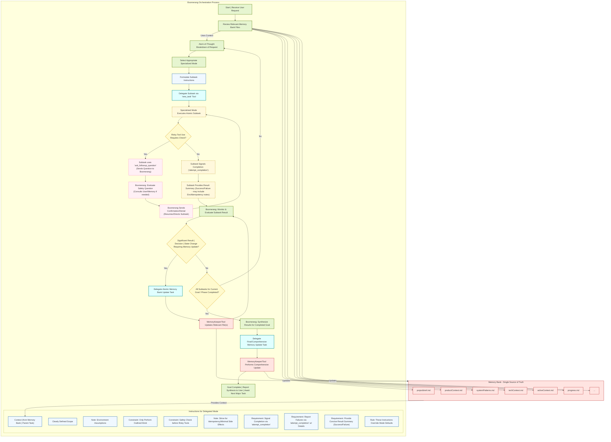
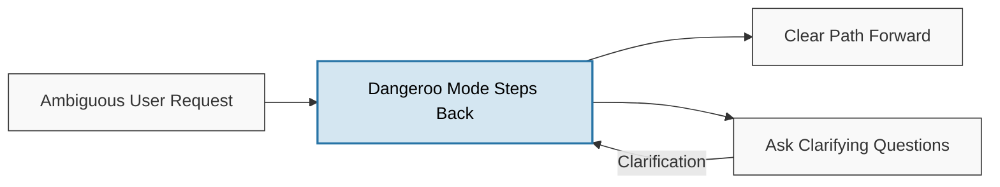
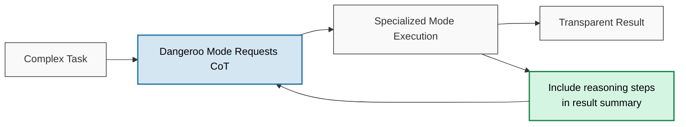
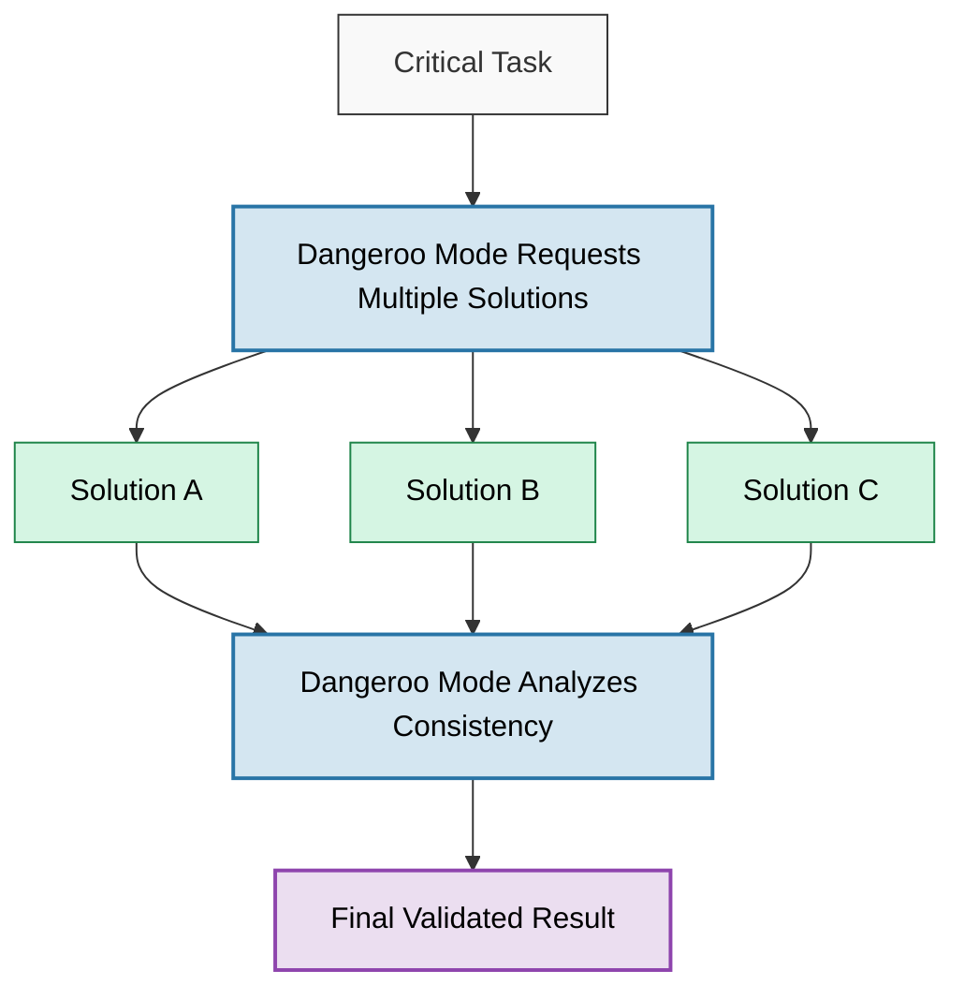
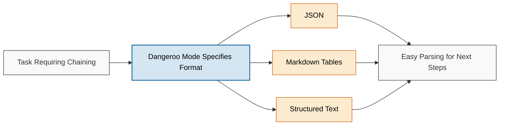

# Boomerang Software Engineering Orchestrator (Dan Mode)

## Overview

🦘Dangeroo Mode🤖 is an AI-powered system designed to assist with complex software engineering tasks. It operates through a sophisticated orchestration pattern, leveraging specialized AI "modes" to handle different aspects of the software development lifecycle. The central orchestrator, known as "Dangeroo Mode" (internally using Boomerang Mode in RooCode), breaks down large requests into minimal, self-contained subtasks, delegates them to the appropriate specialized mode, tracks progress, and manages project context using a persistent memory bank.

The system is designed for robustness, traceability, and high-quality output by combining:
*   **Specialization:** Different modes handle coding, architecture, testing, etc.
*   **Atomicity:** Tasks are broken down into the smallest logical units.
*   **Statefulness:** A structured memory bank (`.roo-docs/`) maintains context across sessions.
*   **Advanced Prompting:** Techniques like Step-back, Chain-of-Thought, Self-Consistency, and Structured Outputs are used for clarity and reliability.
*   **Explicit Guardrails:** Specific instructions ensure modes handle failures, safety, and environmental factors predictably.

## Core Concepts

### 1. Orchestration (Dangeroo Mode / Boomerang Mode)
Dan Mode acts as the central coordinator. It does not perform specific engineering tasks itself but instead focuses on:
*   **Task Decomposition:** Applying an "atom-of-thought" approach to break user requests into minimal subtasks.
*   **Mode Selection:** Choosing the best specialized mode for each subtask.
*   **Instruction Formulation:** Providing detailed, context-rich instructions for each delegation.
*   **Advanced Prompting:** Utilizing techniques like Step-back prompting for clarification, requesting Chain-of-Thought for transparency, initiating Self-Consistency checks for critical tasks, and asking for Structured Outputs for easier processing.
*   **Progress Tracking:** Monitoring subtask completion and evaluating results (both success and failure).
*   **Decision Making:** Deciding the next step based on subtask outcomes (e.g., delegate next task, delegate debugging, ask user, update memory).
*   **Memory Management:** Interacting with the Memory Bank to load context and store decisions/progress.
*   **Synthesis:** Consolidating results upon goal completion.

### 2. Specialized Modes (Delegates)
Each specialized mode is an AI assistant focused on a specific domain, operating strictly under Dangeroo Mode's direction:
*   **`code` (💻 Code):** Writes, modifies, and explains code based on precise instructions.
*   **`architect` (🏗️ Architect):** Executes atomic design tasks (e.g., schema design, diagramming, API outlining).
*   **`ask` (❓ Ask):** Answers specific technical questions based on provided context and its knowledge base.
*   **`debug` (🐞 Debug):** Performs specific debugging tasks (log analysis, root cause suggestion, fix implementation).
*   **`requirements` (📝 Requirements):** Drafts, clarifies, and documents requirements (user stories, acceptance criteria).
*   **`tester` (🧪 Tester):** Writes tests (unit, integration, E2E), generates test data, analyzes results.
*   **`devops` (⚙️ DevOps):** Handles specific CI/CD, infrastructure, build, and deployment tasks (scripts, configs, IaC).
*   **`writer` (✍️ Technical Writer):** Creates and updates documentation (API docs, user guides, memory bank files).
*   **`uiux` (🎨 UI/UX Designer):** Provides conceptual UI/UX input (flows, component suggestions, critiques, accessibility).
*   **`security` (🔒 Security Analyst):** Performs specific security reviews and analysis tasks.
*   **`memorykeeper` (💾 Memory Keeper):** Executes precise read/write operations on the memory bank files, acting as a scribe.

These modes are designed to execute only the single, atomic task assigned by Dangeroo Mode and report back concisely using the `attempt_completion` tool.

### 3. Atom-of-Thought Principle
Every request is broken down into the smallest possible, logically independent steps. This allows for:
*   **Manageability:** Reduces the complexity handled by any single mode instance.
*   **Traceability:** Makes it easier to follow the workflow and pinpoint issues.
*   **Parallelism:** Enables delegation of independent tasks simultaneously (platform permitting).
*   **Reduced Error Propagation:** Limits the impact of a failure in one subtask.

### 4. Memory Bank (`.roo-docs/`)
This directory structure is the cornerstone of Roo's statefulness and long-term project understanding. It serves as the single source of truth.
*   **Persistence:** Stores project context, decisions, progress, and history across work sessions.
*   **Structure:** Organized into key Markdown files:
    *   `.roo-docs/projectbrief.md`: Core goals.
    *   `.roo-docs/productContext.md`: The "why" and user goals.
    *   `.roo-docs/systemPatterns.md`: Architecture and design.
    *   `.roo-docs/techContext.md`: Languages, frameworks, dependencies, environment details.
    *   `.roo-docs/activeContext.md`: Current focus, recent decisions.
    *   `.roo-docs/progress.md`: Status, issues, roadmap.
    *   *(Other files as needed)*
*   **Usage:** Dangeroo Mode reviews relevant files at the start of a task and delegates updates (via `MemoryKeeper`) as significant decisions are made or tasks complete. It's also used to store reasoning (CoT) and validation outcomes.

## Workflow Logic (Flowchart)

The following diagram illustrates the interaction flow between Dangeroo Mode (Boomerang), the specialized modes, and the memory bank, including the crucial failure reporting and safety check loops:

## Workflow Explanation

Dangeroo Mode reviews the memory bank (B) and breaks down the user request (C).
It selects a mode (D) and formulates detailed instructions (J).
It delegates the task (D_delegate) to the specialized mode (S).

**Safety Check:** The mode checks if a risky tool operation is required (S_check). If yes, it pauses and asks Dangeroo Mode for confirmation (S_ask -> E_q -> S_confirm) before proceeding.

**Completion/Failure:** The mode either completes successfully or reports a failure using attempt_completion (S_comp).

Dangeroo Mode evaluates the result (E).

**Memory Update:** If needed, Dangeroo Mode delegates a memory update (F -> I_delegate).

**Next Step:** Dangeroo Mode decides whether more subtasks are needed for the current goal (G) or if the goal is complete. If not complete, it loops back to breakdown (C); if complete, it synthesizes results (H), performs a final memory update (I_final_delegate), and reports to the user (Z).

### Advanced Prompting Techniques

Dangeroo Mode employs several techniques to improve the quality and reliability of the workflow:

- **Step-back Prompting:** Used by Dangeroo Mode when a user request is ambiguous or a path forward isn't clear. It involves asking clarifying questions or exploring options before delegating subtasks.

- **Chain-of-Thought (CoT):** Dangeroo Mode may explicitly request specialized modes to include concise reasoning steps in their result summary, especially for complex analytical or design tasks. This aids transparency and debugging. CoT results may be stored in the memory bank.

- **Self-Consistency:** For critical or error-prone subtasks, Dangeroo Mode may ask a mode to generate multiple distinct solutions/outputs. Dangeroo Mode then analyzes these for consistency or correctness before proceeding. Validation outcomes can be stored in the memory bank.

- **Structured Outputs:** Dangeroo Mode often instructs modes to return results in specific formats (e.g., JSON, Markdown tables) to allow for easier parsing and reliable chaining of subtasks.

**Important Note:** Specialized modes do not use these techniques proactively. They only provide CoT, multiple outputs, or specific formatting when explicitly requested in the task instructions from Dangeroo Mode.

### Explicit Guardrails & Failure Handling

To address potentially critical issues arising from implicit assumptions, specific instructions have been added to the specialized modes:

- **Failure Reporting:** Modes are explicitly instructed MUST use attempt_completion to report failure if they encounter an insurmountable error during execution. They must provide clear details about the failure (error messages, logical conflicts, etc.) and any partial results. This prevents modes from getting stuck, deviating, or silently failing, ensuring Dangeroo Mode is always informed.

- **Tool Safety Check:** Modes with access to potentially destructive or resource-intensive tools (execute_command, browser_action) - specifically debug, tester, devops, security - MUST pause, describe the intended risky action, and request confirmation from Dangeroo Mode using ask_followup_question before proceeding. This acts as a critical safety layer, keeping the orchestrator in control of potentially harmful operations.

- **Environment Awareness:** Modes that depend on a specific environment (code, debug, tester, devops, security) are instructed to assume the environment matches techContext.md or task specifics. If required tools, dependencies, or services are missing and block execution, they MUST report this as a failure requirement, rather than assuming they exist or attempting complex setup.

- **Idempotency & Side Effects:** Modes generating code, scripts, or configurations (code, devops, tester) are encouraged to strive for idempotency (safe to run multiple times) and minimize side effects. They should flag potential risks in their summaries.

These explicit instructions act as crucial guardrails, making the system's behavior more predictable, robust, and safe by forcing modes to handle common failure points and risks in a structured way that feeds back into the orchestration layer.

### Usage

Interaction typically happens with Dangeroo Mode. The user provides a high-level goal or task (e.g., "Implement user authentication using JWT", "Refactor the database access layer", "Add unit tests for the payment module"). Dangeroo Mode then handles the entire process of breaking down the task, orchestrating the specialized modes, managing context, and reporting the final outcome. The user may be consulted via ask_followup_question if clarification is needed or if a safety check requires confirmation.

`.roomodes.initialise` is a prototype prompt with the intended purpose of using this with your LLM model of choice to 'intialise' context for the RooCode system. It is not a complete prompt and should be used as a starting point for your own implementation. The prompt is designed to be used with the RooCode system and should be modified to suit your specific needs.