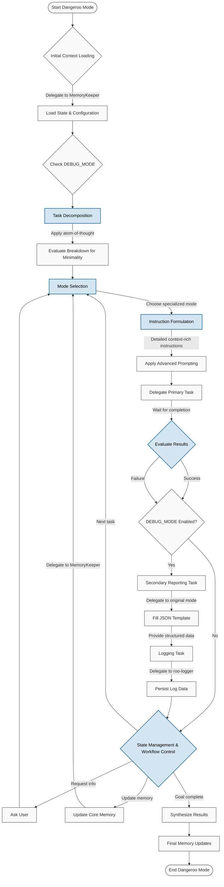

<p align="center">
  
</p>

# Dangeroo Mode - (Boomerang) Software Engineering Orchestrator

## Overview

🦘Dangeroo Mode🤖 is an AI-powered system designed to assist with complex software engineering tasks. It operates through a sophisticated orchestration pattern, leveraging specialized AI "modes" to handle different aspects of the software development lifecycle. The central orchestrator, known as "Dangeroo Mode" (internally using Boomerang Mode in RooCode), breaks down large requests into minimal, self-contained subtasks, delegates them to the appropriate specialized mode, tracks progress, manages project context using a persistent memory bank, and implements conditional structured logging for enhanced observability.

The system is designed for robustness, traceability, and high-quality output by combining:
*   **Specialization:** Different modes handle coding, architecture, testing, logging, etc.
*   **Atomicity:** Tasks are broken down into the smallest logical units.
*   **Statefulness:** A structured memory bank (`.roo-docs/`) maintains context, configuration, templates, and logs across sessions.
*   **Advanced Prompting:** Techniques like Step-back, Chain-of-Thought, Self-Consistency, and Structured Outputs are used for clarity and reliability.
*   **Explicit Guardrails:** Specific instructions ensure modes handle failures, safety, and environmental factors predictably.
*   **Conditional Structured Logging:** Detailed task success/failure information is logged in a structured format (using templates) when `DEBUG_MODE` is enabled.

## Core Concepts

### 1. Orchestration (Dangeroo Mode / Boomerang Mode)
Dangeroo Mode acts as the central coordinator. It does not perform specific engineering tasks itself but instead focuses on:
*   **Initial Context Loading:** Delegating to `MemoryKeeper` to load initial state and configuration (including `DEBUG_MODE` status) from `.roo-docs/`.
*   **Task Decomposition:** Applying an "atom-of-thought" approach and evaluating the breakdown for true minimality.
*   **Mode Selection:** Choosing the best specialized mode for each primary subtask.
*   **Instruction Formulation:** Providing detailed, context-rich instructions for primary delegations.
*   **Advanced Prompting:** Utilizing techniques strategically during primary task delegation.
*   **Result Evaluation:** Analyzing the concise `attempt_completion` result from specialized modes to determine success or failure for immediate workflow decisions.
*   **Conditional Logging Orchestration:**
    *   Checking if `DEBUG_MODE` is enabled.
    *   If enabled, delegating a *secondary reporting task* to the *original mode* that completed the primary task, instructing it to fill a standardized JSON template (from `.roo-docs/templates/`) with detailed execution context.
    *   Receiving the filled template data.
    *   Delegating a *logging task* to the dedicated `roo-logger` mode, providing the structured JSON data for persistence.
*   **State Management & Workflow Control:** Deciding the next primary workflow step based on the *core* subtask outcome (e.g., delegate next task, delegate debugging, ask user, delegate core memory updates via `MemoryKeeper`, synthesize).
*   **Synthesis:** Consolidating results upon goal completion and triggering final memory updates.

### 2. Specialized Modes (Delegates)
Each specialized mode is an AI assistant focused on a specific domain, operating strictly under Dangeroo Mode's direction:
*   **`code` (💻 Code):** Writes, modifies, and explains code.
*   **`architect` (🏗️ Architect):** Executes atomic design tasks.
*   **`ask` (❓ Ask):** Answers specific technical questions.
*   **`debug` (🐞 Debug):** Performs specific debugging tasks.
*   **`requirements` (📝 Requirements):** Drafts, clarifies, and documents requirements.
*   **`tester` (🧪 Tester):** Writes tests, generates test data, analyzes results.
*   **`devops` (⚙️ DevOps):** Handles specific CI/CD, infrastructure, build, and deployment tasks.
*   **`writer` (✍️ Technical Writer):** Creates and updates documentation.
*   **`uiux` (🎨 UI/UX Designer):** Provides conceptual UI/UX input.
*   **`security` (🔒 Security Analyst):** Performs specific security reviews.
*   **`memorykeeper` (💾 Memory Keeper):** Executes precise read/write operations on the memory bank files (core context, `.env`, templates).
*   **`roo-logger` (📜 Roo Logger):** Receives pre-formatted JSON log data and appends it to the designated log file(s) (within `.roo-docs/logs/`).

Modes execute their assigned *primary* task and report back *concisely*. If `DEBUG_MODE` is on, the mode that performed the primary task may receive a *secondary* task to provide detailed structured reporting by filling a JSON template.

### 3. Atom-of-Thought Principle
Remains the same: breaking down work into minimal, traceable, manageable units.

### 4. Memory Bank (`.roo-docs/`)
This directory structure is the cornerstone of Roo's statefulness.
*   **Persistence:** Stores project context, decisions, progress, history, configuration, templates, and detailed logs.
*   **Structure:** Organized into key files and directories:
    *   `.roo-docs/projectbrief.md`: Core goals.
    *   `.roo-docs/productContext.md`: The "why" and user goals.
    *   `.roo-docs/systemPatterns.md`: Architecture and design.
    *   `.roo-docs/techContext.md`: Tech stack, environment details.
    *   `.roo-docs/activeContext.md`: Current focus, recent decisions.
    *   `.roo-docs/progress.md`: High-level status, issues, roadmap.
    *   `.roo-docs/.env`: Configuration variables (e.g., `DEBUG_MODE=TRUE`).
    *   `.roo-docs/templates/`: Contains JSON templates (`task_completion_template.json`, `issue_report_template.json`).
    *   `.roo-docs/logs/`: Contains structured log files (e.g., `activity.log`).
    *   *(Other files/folders as needed)*
*   **Usage:** Dangeroo Mode orchestrates interactions via `MemoryKeeper` (for core files, `.env`, templates) and `roo-logger` (for `logs/`). The memory bank provides context for decision-making and stores detailed operational history when debugging is enabled.

## Workflow Logic (Flowchart)

The following diagram illustrates the updated interaction flow, including the two-stage conditional logging process:



## Workflow Explanation (Updated)
1.  Dangeroo Mode initiates context loading via `MemoryKeeper` (`B_delegate` -> `B_res`).
2.  It breaks down the user request (`C`), ensuring atomicity.
3.  It delegates the primary subtask (`D_delegate`) to a specialized mode (`S`).
4.  **Safety Check:** The mode checks for risky operations (`S_check`) and requests confirmation from Dangeroo if needed (`S_ask` loop).
5.  **Completion:** The mode completes the primary task, reporting a *concise* success/failure summary (`S_comp` -> `S_res`).
6.  **Evaluation:** Dangeroo analyzes this concise result (`E`).
7.  **Conditional Logging:**
    *   Dangeroo checks `DEBUG_MODE` (`E_checkEnv` -> `E_debugDecision`).
    *   If TRUE, Dangeroo delegates a secondary 'reporting' task to the *original mode* (`L_delegate_report`).
    *   The original mode fills the relevant JSON template (Success/Failure) using its recent context (`L_report_exec`) and returns the filled JSON (`L_report_res`).
    *   Dangeroo delegates a 'logging' task to `roo-logger`, passing the filled JSON (`L_delegate_log`).
    *   `roo-logger` appends the JSON to the log file (`L_exec` -> `L_res`).
8.  **Core Workflow Continuation:** The flow proceeds to decision point `F`, based on the *concise result* from step 5.
9.  **Core Memory Update:** Dangeroo decides if an *immediate* update to core memory files (like `progress.md`) is needed based on the concise result (`F`) and delegates to `MemoryKeeper` if required (`I_delegate` -> `I_exec`).
10. **Next Step Decision:** Dangeroo determines if more primary subtasks are needed (`G`). If yes, loop back to breakdown (`C`). If no (goal complete), proceed to synthesis (`H`).
11. **Finalization:** Synthesize results (`H`), delegate final comprehensive core memory updates (`I_final_delegate` -> `I_final_exec`), and report to the user (`Z`).

## Advanced Prompting Techniques (Includes minor clarification)

Dangeroo Mode employs several techniques to improve the quality and reliability of the workflow:

-   **Step-back Prompting:** Used by Dangeroo Mode when a user request is ambiguous or a path forward isn't clear. It involves asking clarifying questions or exploring options *before* delegating subtasks.
    ```mermaid
    flowchart LR
        A["Ambiguous User Request"] --> B["Dangeroo Mode Steps Back"]
        B --> C["Clear Path Forward"]
        B --> D["Ask Clarifying Questions"]
        D -->|"Clarification"| B

        classDef default fill:#f9f9f9,stroke:#333,stroke-width:1px,color:#333
        classDef focus fill:#d4e6f1,stroke:#2874a6,stroke-width:2px,color:#000

        class B focus
    ```
-   **Chain-of-Thought (CoT):** Dangeroo Mode may explicitly request specialized modes to include concise reasoning steps in their *concise* result summary or, more likely, request it as part of the *detailed reporting task* (when `DEBUG_MODE` is on). This aids transparency and debugging. CoT results may be stored in the memory bank or the detailed logs.
    ```mermaid
    flowchart LR
        A["Complex Task"] --> B["Dangeroo Mode Requests CoT (in primary or reporting task)"]
        B --> C["Specialized Mode Execution"]
        C --> D["Transparent Result/Report"]

        C --> E["Include reasoning steps\nin summary/template"]
        E --> B

        classDef default fill:#f9f9f9,stroke:#333,stroke-width:1px,color:#333
        classDef focus fill:#d4e6f1,stroke:#2874a6,stroke-width:2px,color:#000
        classDef reasoning fill:#d5f5e3,stroke:#1e8449,stroke-width:2px,color:#000

        class B focus
        class E reasoning
    ```
-   **Self-Consistency:** For critical or error-prone subtasks, Dangeroo Mode may ask a mode to generate multiple distinct solutions/outputs during the *primary* task. Dangeroo Mode then analyzes these for consistency or correctness *before* proceeding (Step `E` in main flowchart). Validation outcomes can be stored in the memory bank or logs.
    ```mermaid
    flowchart TD
        A["Critical Task"] --> B["Dangeroo Mode Requests Multiple Solutions"]

        B --> C["Solution A"]
        B --> D["Solution B"]
        B --> E["Solution C"]

        C --> F["Dangeroo Mode Analyzes Consistency (Step E)"]
        D --> F
        E --> F

        F --> G["Final Validated Result/Decision"]

        classDef default fill:#f9f9f9,stroke:#333,stroke-width:1px,color:#333
        classDef focus fill:#d4e6f1,stroke:#2874a6,stroke-width:2px,color:#000
        classDef solution fill:#d5f5e3,stroke:#1e8449,stroke-width:1px,color:#000
        classDef result fill:#ebdef0,stroke:#8e44ad,stroke-width:2px,color:#000

        class B,F focus
        class C,D,E solution
        class G result
    ```

-   **Structured Outputs:** Dangeroo Mode instructs modes to return the *concise* result summary reliably, and explicitly requires JSON format for the *detailed reporting task* (when `DEBUG_MODE` is on) via templates.
    ```mermaid
    flowchart LR
        A["Need for Reliable Data"] --> B["Dangeroo Mode Uses Templates"]

        B --> C["Concise Summary\n(from attempt_completion)"]
        B --"If DEBUG_MODE=TRUE"--> D["Detailed JSON Report\n(from Reporting Task)"]


        C --> F["Input for Immediate\nWorkflow Decision (Step E)"]
        D --> G["Input for Logging\n& Deep Analysis"]

        classDef default fill:#f9f9f9,stroke:#333,stroke-width:1px,color:#333
        classDef focus fill:#d4e6f1,stroke:#2874a6,stroke-width:2px,color:#000
        classDef format fill:#fdebd0,stroke:#d35400,stroke-width:1px,color:#000

        class B focus
        class C,D format
    ```
**Important Note:** Specialized modes focus on their primary task and concise reporting. They only perform detailed template filling when explicitly given a secondary reporting task by Dangeroo Mode.

## Explicit Guardrails & Failure Handling

To address potentially critical issues arising from implicit assumptions, specific instructions have been added to the specialized modes:

* Failure Reporting: Modes are explicitly instructed MUST use attempt_completion to report failure if they encounter an insurmountable error during execution. They must provide clear details about the failure (error messages, logical conflicts, etc.) and any partial results. This prevents modes from getting stuck, deviating, or silently failing, ensuring Dangeroo Mode is always informed.

* Tool Safety Check: Modes with access to potentially destructive or resource-intensive tools (execute_command, browser_action) - specifically debug, tester, devops, security - MUST pause, describe the intended risky action, and request confirmation from Dangeroo Mode using ask_followup_question before proceeding. This acts as a critical safety layer, keeping the orchestrator in control of potentially harmful operations.

* Environment Awareness: Modes that depend on a specific environment (code, debug, tester, devops, security) are instructed to assume the environment matches techContext.md or task specifics. If required tools, dependencies, or services are missing and block execution, they MUST report this as a failure requirement, rather than assuming they exist or attempting complex setup.

* Idempotency & Side Effects: Modes generating code, scripts, or configurations (code, devops, tester) are encouraged to strive for idempotency (safe to run multiple times) and minimize side effects. They should flag potential risks in their summaries.

These explicit instructions act as crucial guardrails, making the system's behavior more predictable, robust, and safe by forcing modes to handle common failure points and risks in a structured way that feeds back into the orchestration layer.

## Usage

Interaction typically happens with Dangeroo Mode. The user provides a high-level goal or task (e.g., "Implement user authentication using JWT", "Refactor the database access layer", "Add unit tests for the payment module"). Dangeroo Mode then handles the entire process of breaking down the task, orchestrating the specialized modes, managing context, and reporting the final outcome. The user may be consulted via ask_followup_question if clarification is needed or if a safety check requires confirmation.

.roomodes.initialise is a prototype prompt with the intended purpose of using this with your LLM model of choice to 'intialise' context for the RooCode system. It is not a complete prompt and should be used as a starting point for your own implementation. The prompt is designed to be used with the RooCode system and should be modified to suit your specific needs.

I have been testing using :

```prompt
Create a whimsical, Ghibli-inspired LLM-powered web chat application that exudes the gentle, enchanting aesthetic of Studio Ghibli films. Keep the interface minimalist yet visually captivating, with pastel color schemes, subtle animations, and charming background illustrations. Implement an interactive chat window that seamlessly displays user messages alongside an AI assistant avatar styled as a friendly forest spirit. Infuse delight at every turn with playful hover effects, smooth transitions, and a cozy branding feel. Ensure the user experience is intuitive and magical, inviting visitors to explore an immersive environment that combines simple functionality with the timeless wonder of Ghibli storytelling.
```
<p align="center">
  
</p>

## Structured Logging Templates

JSON templates for successful task completion and issue reporting are stored in `.roo-docs/templates/`. These are filled by the original specialized mode during the secondary reporting task (if `DEBUG_MODE` is enabled) and then passed to `roo-logger` for persistence in `.roo-docs/logs/`. This provides detailed, structured data for observability and future analysis.

## `.roomodes.initialise` (Note)

The `.roomodes.initialise` prompt mentioned previously serves as a conceptual starting point for bootstrapping the *initial content* of the `.roo-docs/` memory bank by analyzing an existing codebase. It would need to be adapted and executed (likely via Dangeroo Mode delegating analysis tasks) when starting work on a pre-existing project.

## Conclusion

The Dangeroo AI system, orchestrated by Boomerang Mode in Roo-Code, represents a structured and robust approach to leveraging LLMs for software engineering. By combining specialization, atomicity, persistent memory, advanced prompting, explicit guardrails, and conditional structured logging, it aims to provide reliable, traceable, observable, and high-quality assistance across the development lifecycle.