# Dangeroo Mem0 MCP Server Architecture

This document provides a detailed overview of the Dangeroo Mem0 MCP Server architecture, focusing on the relationship between FastAPI, ChromaDB, and Neo4j services.

## System Architecture

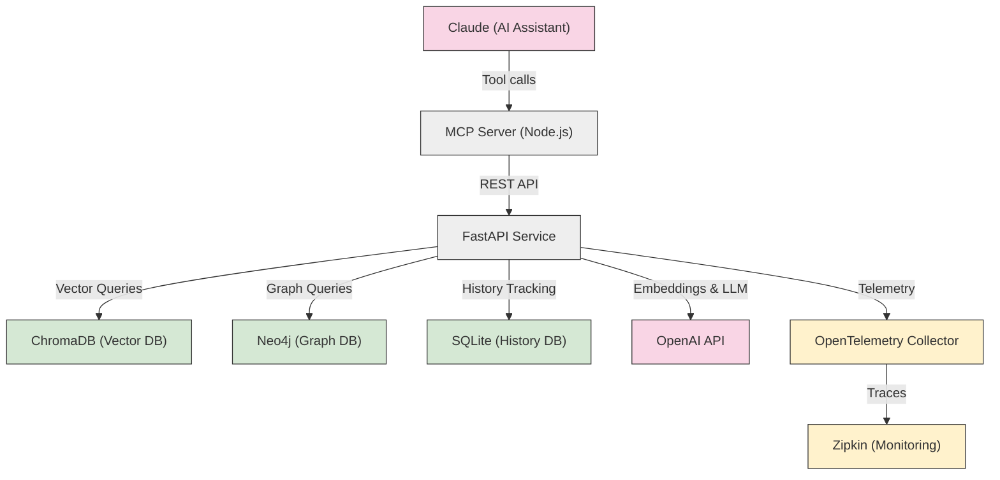

## C4 Container Diagram

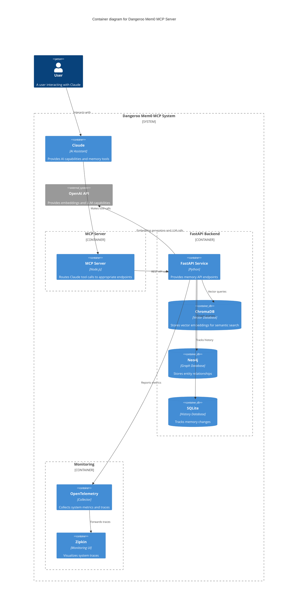

## Detailed Component View
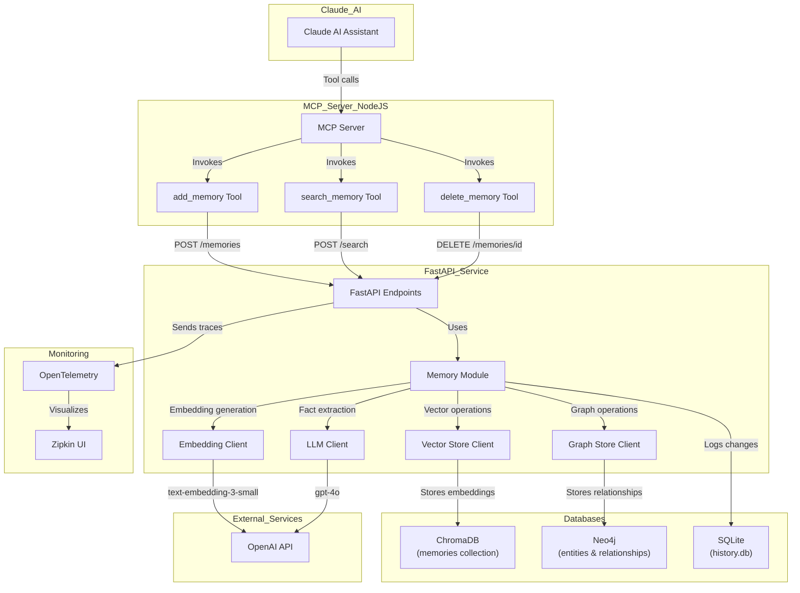

## Memory Storage Flow - add_memory

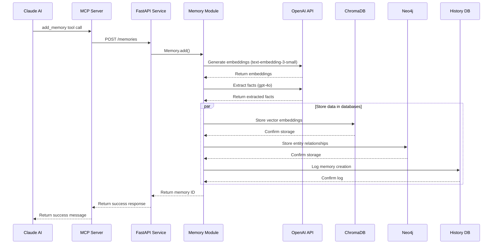

## Memory Retrieval Flow - search_memory

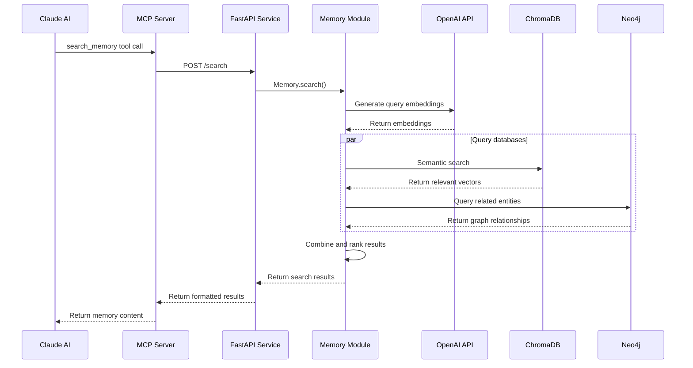

## Data Model

### ChromaDB Collection Schema

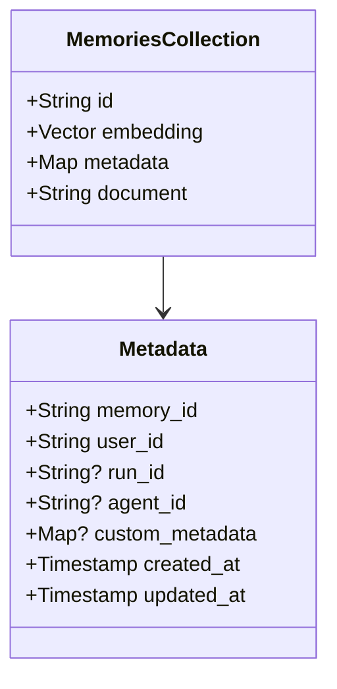

### Neo4j Graph Schema

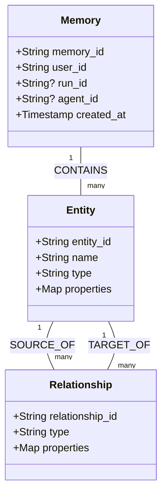

## API Flow for add_memory and search_memory

### add_memory API Flow

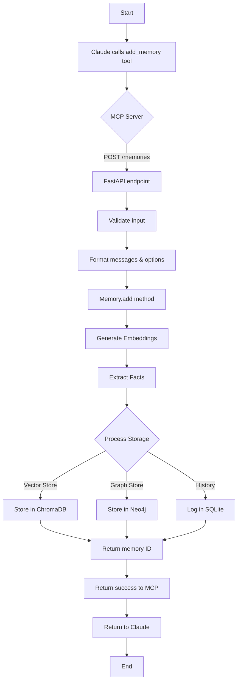

### search_memory API Flow

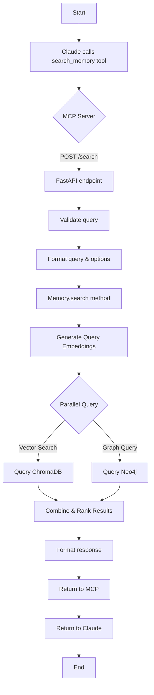

## Docker Containers and Network Architecture

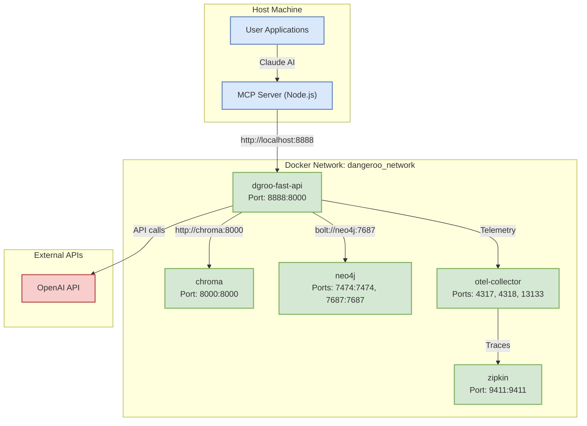

## Volume Mounts and Data Persistence

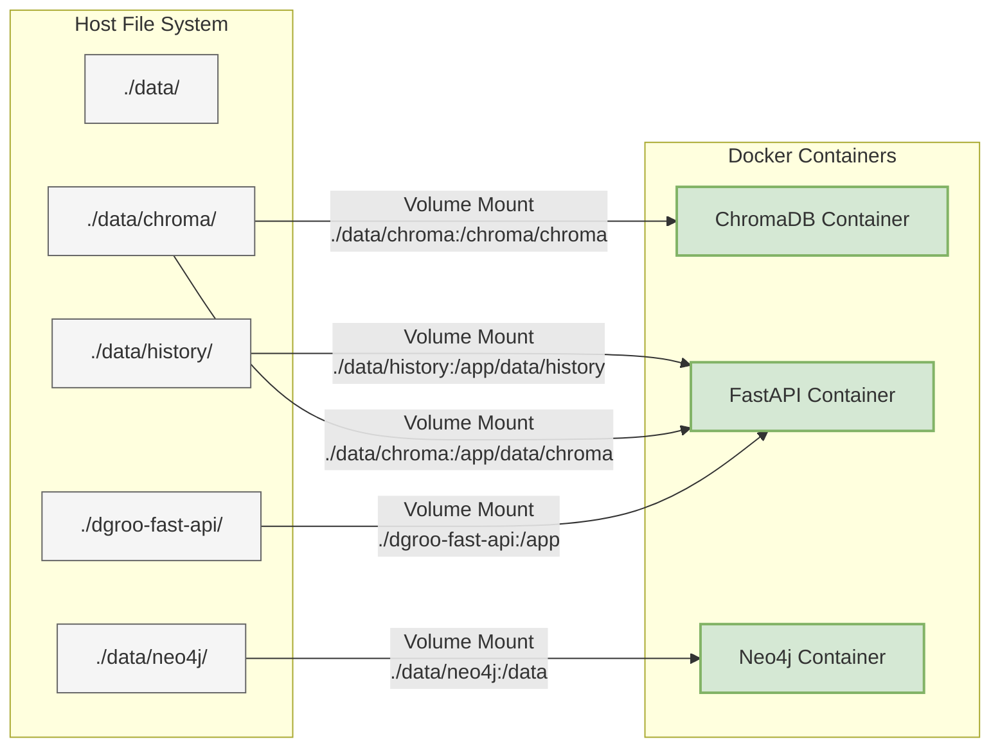