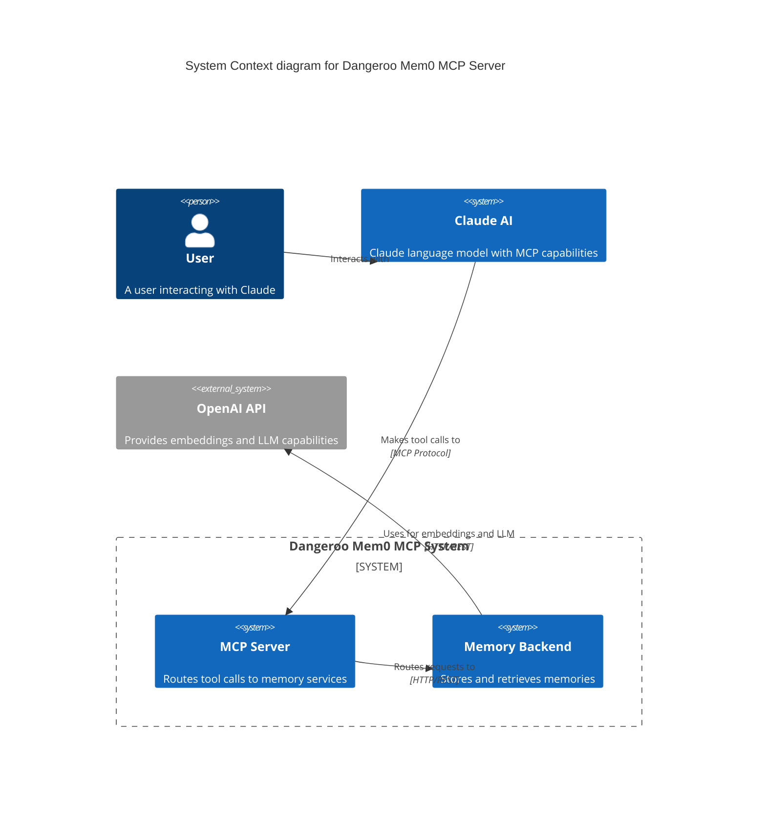
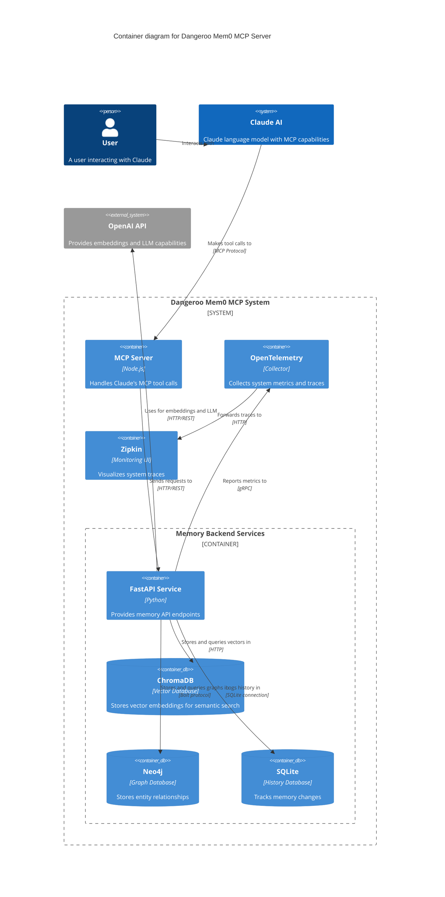
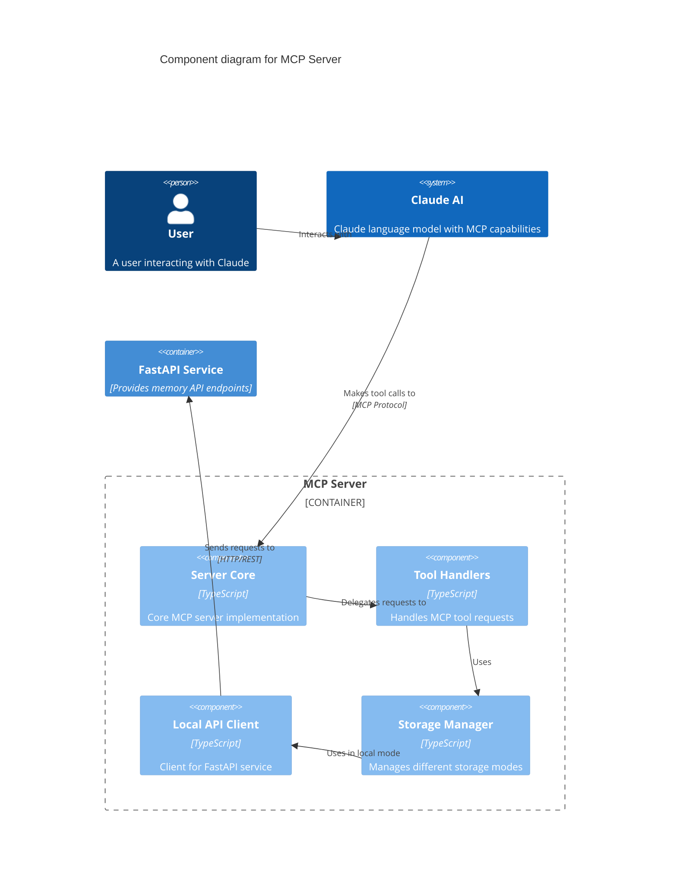
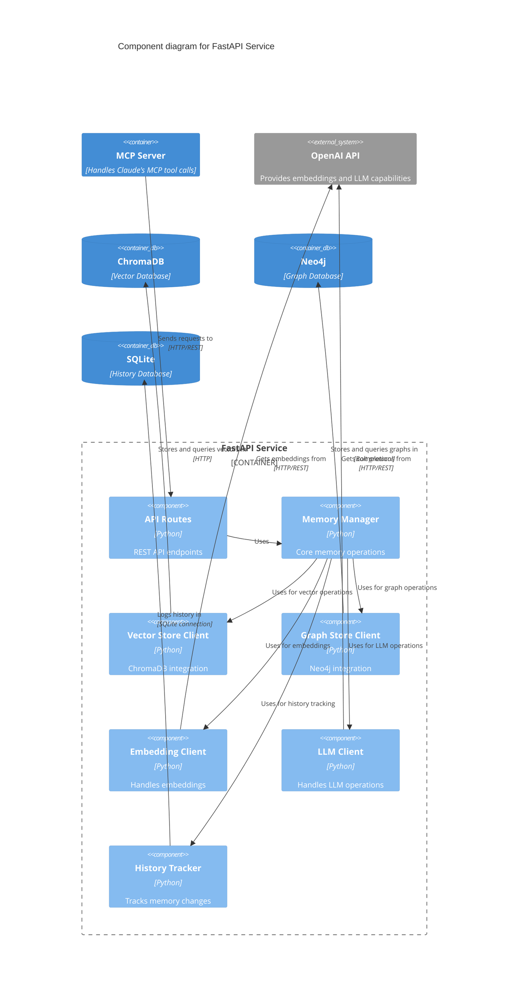
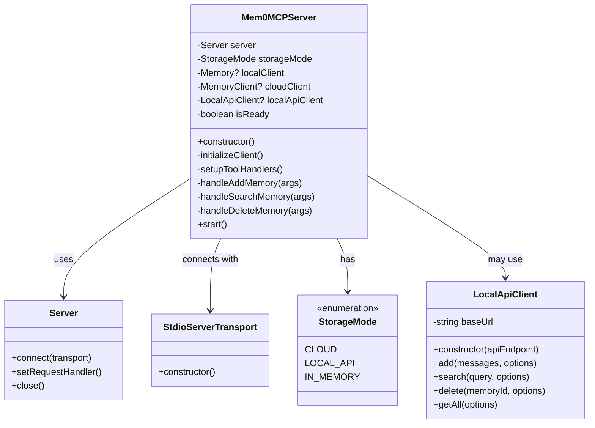
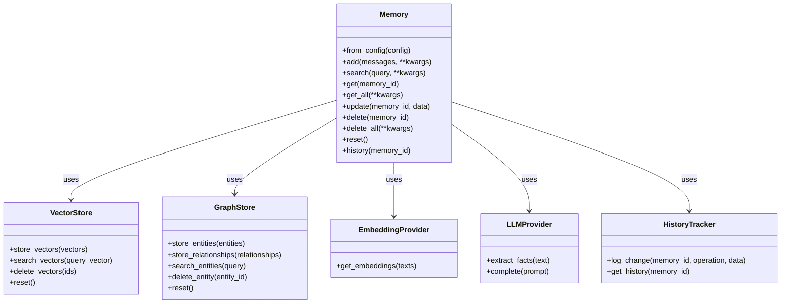
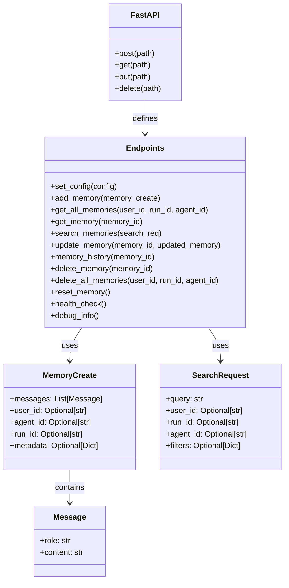
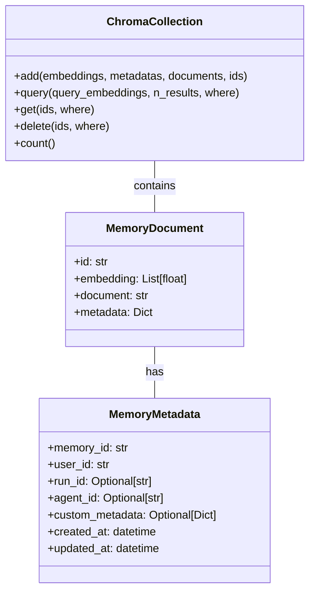
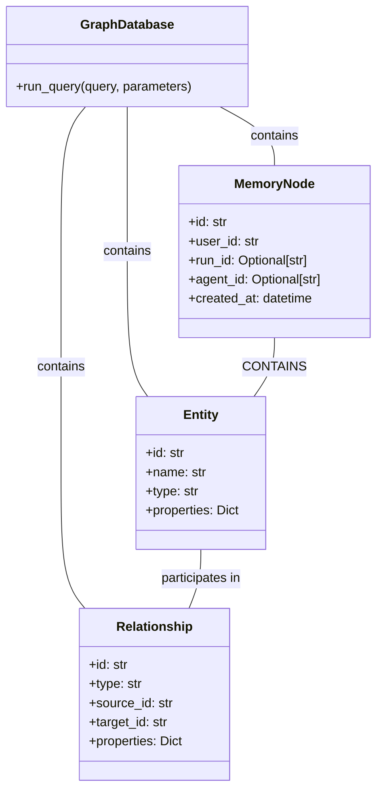
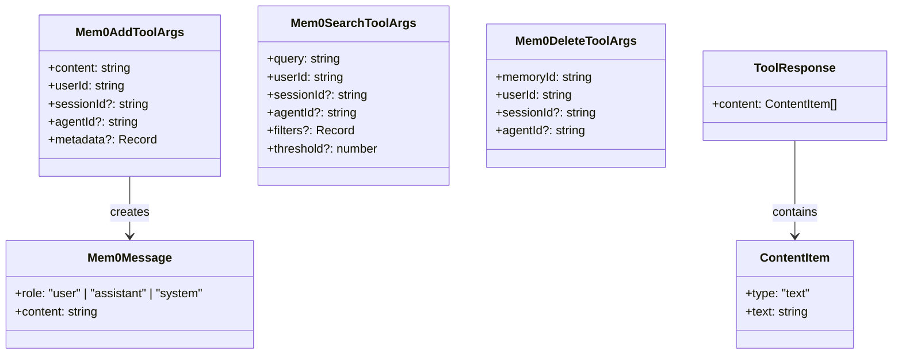

# Dangeroo Mem0 MCP Server C4 Models

This document provides C4 model diagrams for the Dangeroo Mem0 MCP Server. C4 models offer different levels of abstraction to help understand the system architecture.

## Level 1: System Context Diagram

## Level 2: Container Diagram

## Level 3: Component Diagram for MCP Server

## Level 3: Component Diagram for FastAPI Service

## Level 4: Code Diagram for MCP Tool Handling

## Level 4: Code Diagram for Memory Operations

## Level 4: Code Diagram for FastAPI Endpoints

## Data Model Diagrams

### ChromaDB Collection Data Model

### Neo4j Graph Data Model

### MCP Tool Request/Response Models

