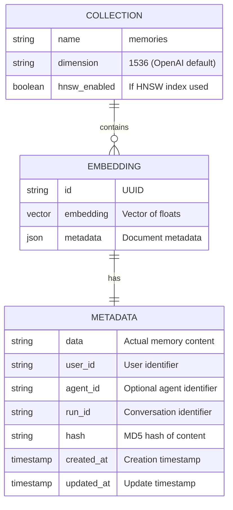
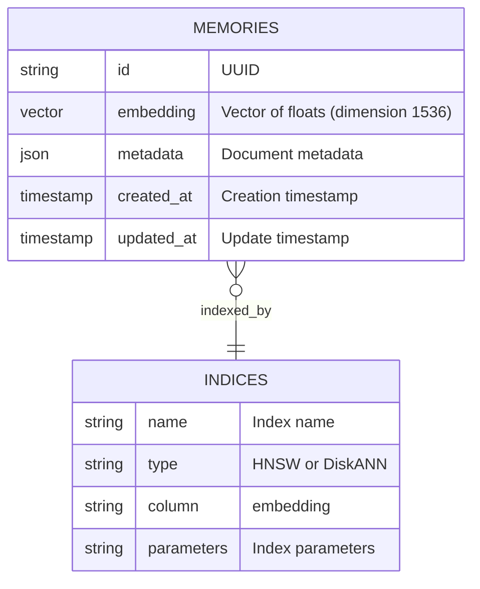
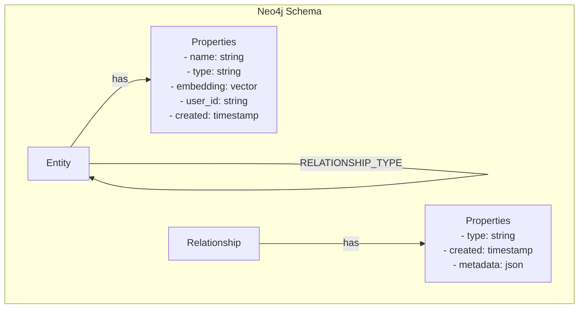
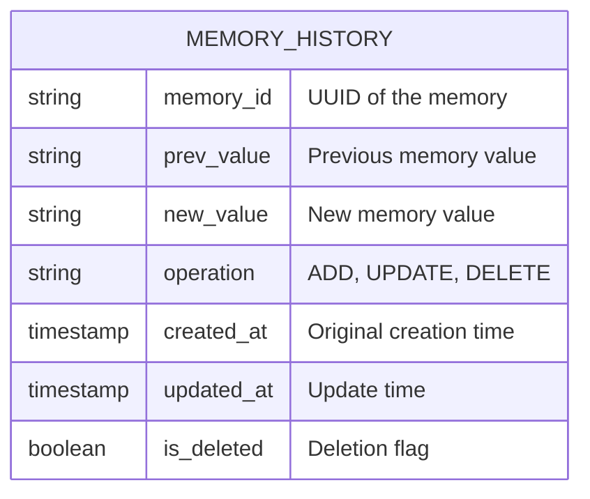
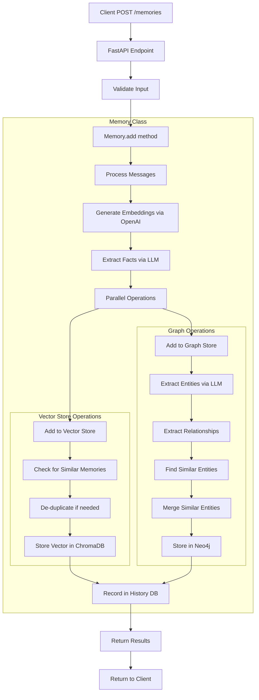
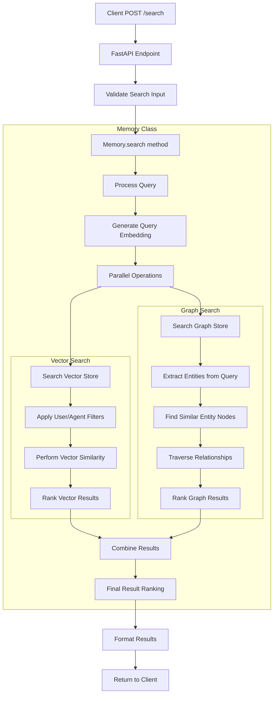
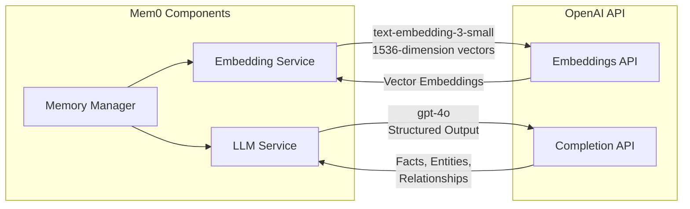
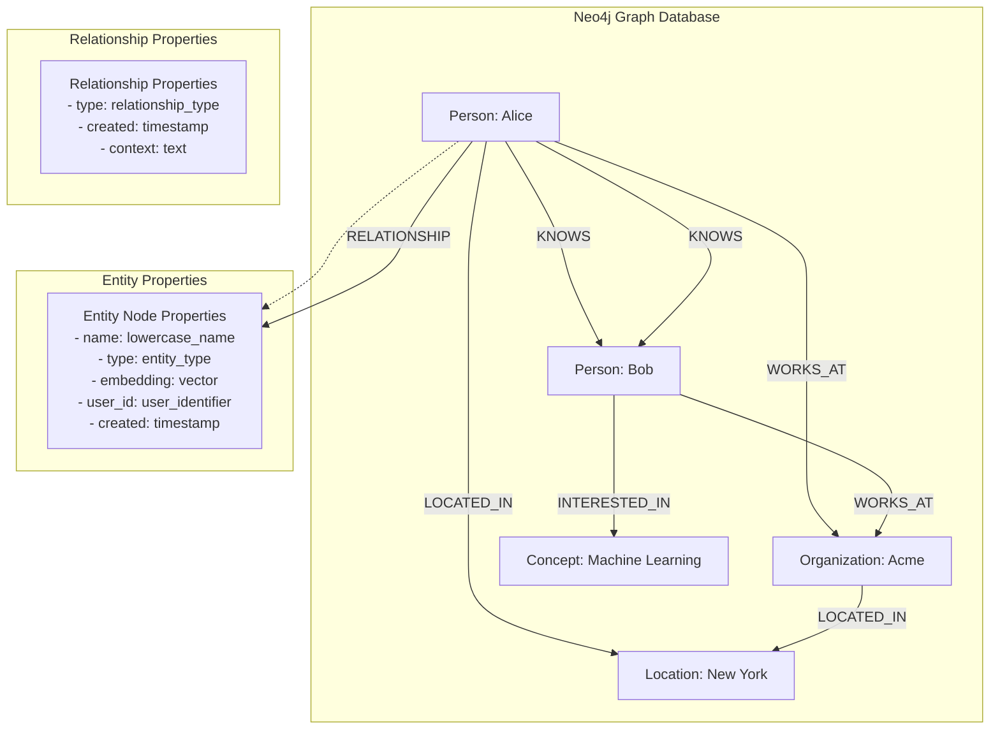
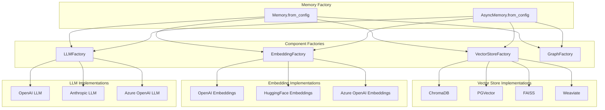

# Detailed Mem0 Architecture

## Database Schemas

### Vector Store - ChromaDB

ChromaDB is the default vector database used for storing embeddings in Mem0. Here's a detailed view of its schema:



Alternatively, when using PGVector:



### Graph Database - Neo4j

Neo4j is used for storing entities and relationships extracted from memories. Its schema:



The Neo4j Cypher schema:

```cypher
// Entity node structure
CREATE (e:Entity {
  name: "entity_name",  // lowercase, spaces_as_underscores
  type: "entity_type",  // person, location, organization, etc.
  embedding: [...],     // vector representation
  user_id: "user123",   // associated user
  created: timestamp()  // creation time
})

// Relationship structure
CREATE (e1:Entity)-[:RELATIONSHIP_TYPE {
  created: timestamp(),
  metadata: {...}
}]->(e2:Entity)
```

### History Database - SQLite

SQLite is used for tracking the history of memory operations:



## Key Functions Flow

### add_memory Detailed Flow



### search_memory Detailed Flow



## API Endpoints 

```mermaid
graph TD
    subgraph "FastAPI Endpoints"
        config["/configure - Set configuration"]
        add["/memories - Create memories"]
        getAll["/memories - Get all memories"]
        getOne["/memories/{id} - Get specific memory"]
        search["/search - Search memories"]
        update["/memories/{id} - Update memory"]
        history["/memories/{id}/history - Get memory history"]
        delete["/memories/{id} - Delete memory"]
        deleteAll["/memories - Delete all memories"]
        reset["/reset - Reset all memories"]
        health["/health - Health check"]
        debug["/debug - Debug information"]
    end
    
    MEMORY[Memory Class] --> config
    MEMORY --> add
    MEMORY --> getAll
    MEMORY --> getOne
    MEMORY --> search
    MEMORY --> update
    MEMORY --> history
    MEMORY --> delete
    MEMORY --> deleteAll
    MEMORY --> reset
```



## OpenAI Integration



## ChromaDB Storage Structure

```mermaid
graph TD
    subgraph "ChromaDB"
        Collection[Collection: "memories"]
        
        subgraph "Documents"
            Doc1[Document 1]
            Doc2[Document 2]
            DocN[Document N]
        end
        
        Collection --> Doc1
        Collection --> Doc2
        Collection --> DocN
        
        Doc1 --> ID1[id: UUID]
        Doc1 --> Embedding1[embedding: Vector]
        Doc1 --> Metadata1[metadata: JSON]
        
        Metadata1 --> Content1[data: Text content]
        Metadata1 --> UserID1[user_id: User identifier]
        Metadata1 --> AgentID1[agent_id: Agent identifier]
        Metadata1 --> RunID1[run_id: Conversation ID]
        Metadata1 --> Hash1[hash: Content hash]
        Metadata1 --> Created1[created_at: Timestamp]
        Metadata1 --> Updated1[updated_at: Timestamp]
    end
```

## Neo4j Graph Model



## Mem0 Internal Factory Architecture

