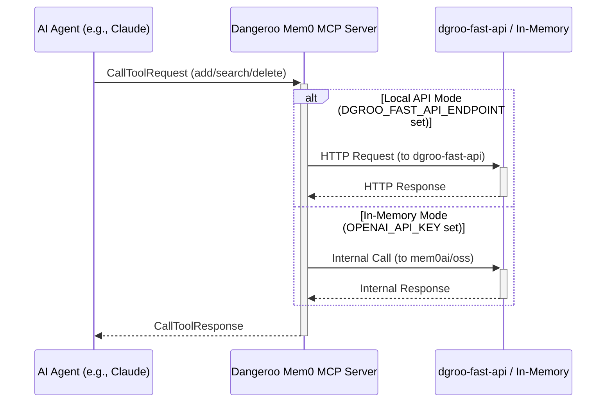

# Dangeroo Mem0 MCP Server

A Model Context Protocol (MCP) server that integrates with a self-hosted `dgroo-fast-api` instance or uses local in-memory storage to provide persistent memory capabilities for LLMs. It allows AI agents to store and retrieve information across sessions.

This server is based on the concept of the original Mem0 MCP but is adapted to work specifically with the `dgroo-fast-api` service or local memory.

## Features

### Storage Modes

The server automatically detects the mode based on environment variables:

*   **Local API Mode**: Connects to a self-hosted `dgroo-fast-api` instance. Activated when `DGROO_FAST_API_ENDPOINT` is set.
*   **In-Memory Mode**: Uses local vector storage with OpenAI embeddings (non-persistent). Activated when `DGROO_FAST_API_ENDPOINT` is *not* set, but `OPENAI_API_KEY` is set.

### Tools

*   **`add_memory`**: Stores text content as a memory associated with a user.
*   **`search_memory`**: Searches stored memories using natural language.
*   **`delete_memory`**: Removes specific memories by ID.

## Configuration

Configuration is managed via environment variables:

1.  **Local API Mode**
    *   Requires `DGROO_FAST_API_ENDPOINT` environment variable (e.g., "http://localhost:8888").
    *   Connects to your self-hosted `dgroo-fast-api` instance.

2.  **In-Memory Mode**
    *   Requires `OPENAI_API_KEY` environment variable for embeddings.
    *   Used if `DGROO_FAST_API_ENDPOINT` is not set.
    *   Stores data in-memory only (non-persistent). Data is lost on server restart.

*Note: At least one of `DGROO_FAST_API_ENDPOINT` or `OPENAI_API_KEY` must be set for the server to start.*

## Installation

```bash
# Clone the repository (if you haven't already)
# git clone https://github.com/your-username/dangeroo-mem0-mcp.git
# cd dangeroo-mem0-mcp

# Install dependencies
npm install

# Build the project
npm run build
```

## Interaction Flow



## MCP Configuration Example

This example shows configuration for **Local API Mode**:

```json
{
  "mcpServers": {
    "dangeroo-mem0": {
      "command": "node",
      "args": [
        "/path/to/dangeroo-mem0-mcp/build/index.js"
      ],
      "env": {
        "DGROO_FAST_API_ENDPOINT": "http://localhost:8888"
        // Or for In-Memory Mode, comment above and uncomment below:
        // "OPENAI_API_KEY": "your-openai-api-key"
      },
      "disabled": false,
      "alwaysAllow": [
        "add_memory",
        "search_memory",
        "delete_memory"
      ]
    }
  }
}
```

## Usage with Cursor, Claude Code, or other MCP-compatible tools

1.  Set up your MCP configuration file (e.g., in Cursor settings) to point to this server's built `index.js`.
2.  Configure the appropriate environment variables (`DGROO_FAST_API_ENDPOINT` or `OPENAI_API_KEY`) within the MCP server definition.
3.  Use the tools (`add_memory`, `search_memory`, `delete_memory`) in your LLM interface.

## Development

```bash
# Watch for changes during development
npm run watch

# Debug MCP protocol messages (requires separate setup)
# npm run inspector