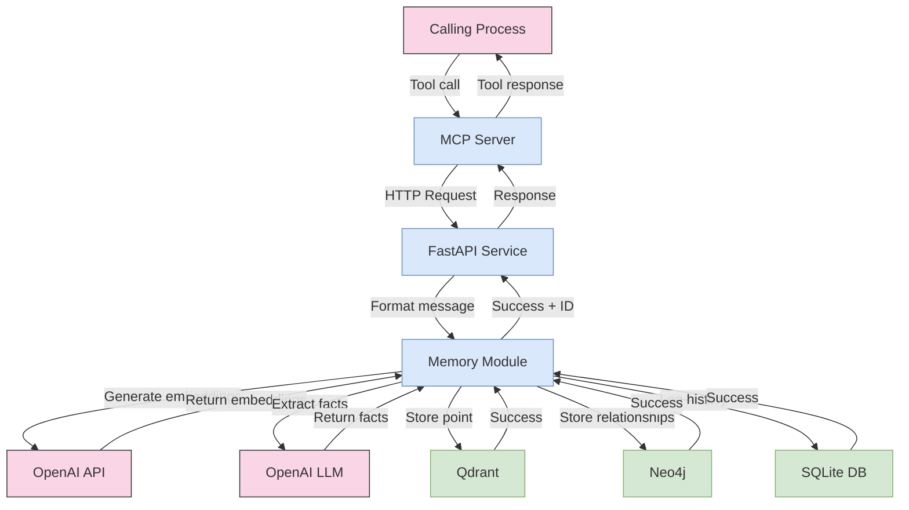
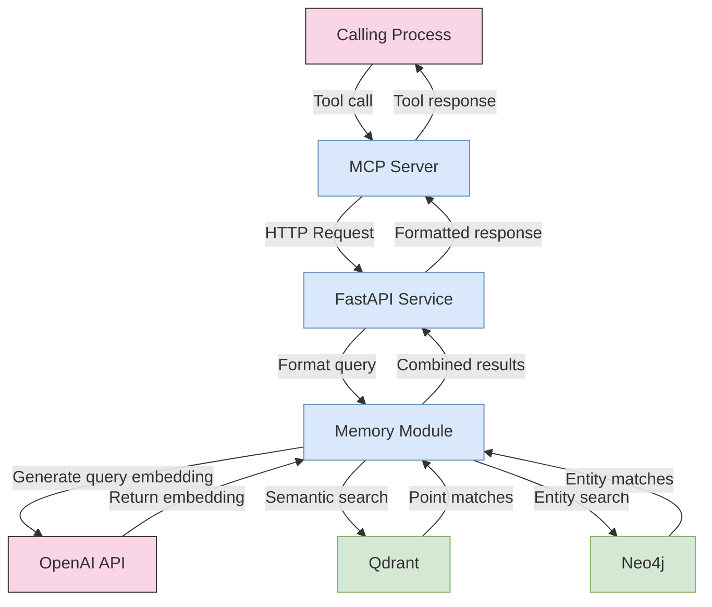
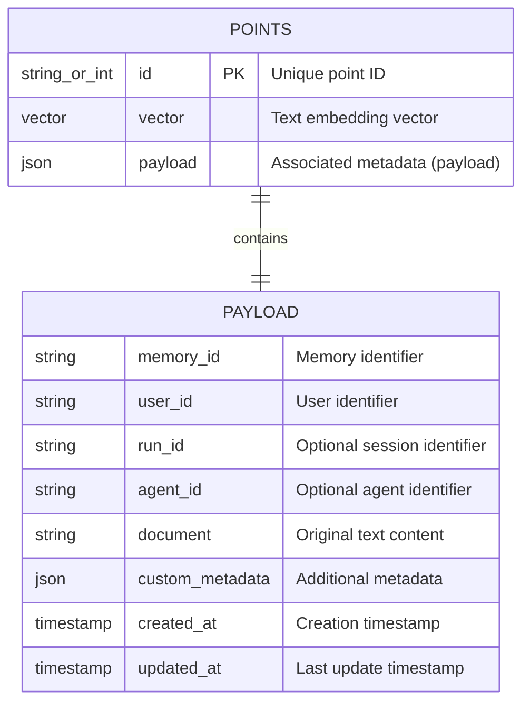
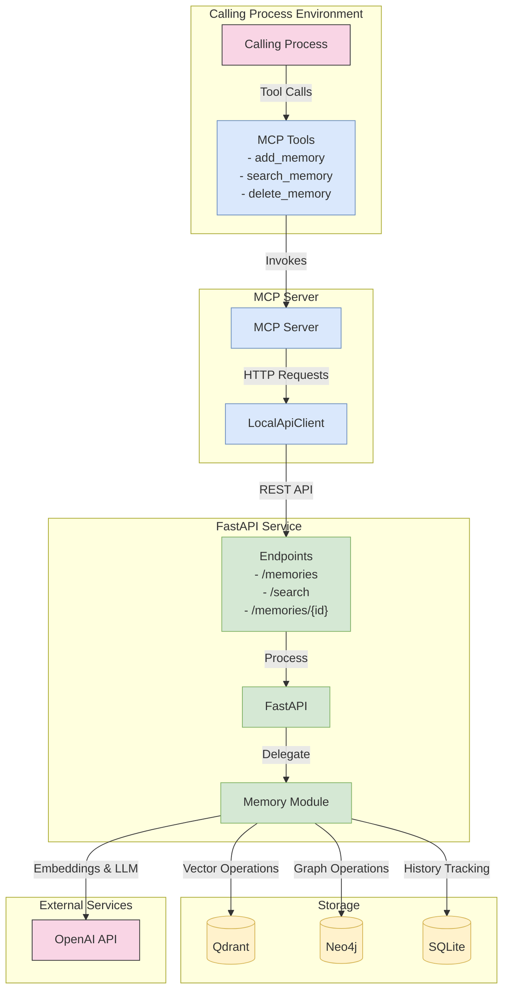

# Dangeroo MCP Server Technical Documentation

This document provides detailed technical information about the Dangeroo MCP Server implementation, focusing on how it integrates with the FastAPI service, Qdrant, and Neo4j.

## MCP Server Implementation

The MCP (Model Context Protocol) Server in the Dangeroo system acts as a bridge between the Calling Process and the memory management backend. It implements tools that the Calling Process can use to store, retrieve, and manage memory.


## Storage Modes

The MCP Server supports three different storage modes:


## Tool Implementation Details

### add_memory Tool


### search_memory Tool


## MCP Configuration

The MCP Server is configured through the `mcp-example.json` file:

```json
{
  "mcpServers": {
    "mem0": {
      "command": "node",
      "args": [
        "build/index.js"
      ],
      "env": {
        "MEM0_MODE": "local",
        "MEM0_API_ENDPOINT": "http://localhost:8888",
        "DEFAULT_USER_ID": "user123"
      },
      "disabled": false,
      "alwaysAllow": [
        "add_memory",
        "search_memory",
        "delete_memory"
      ]
    }
  }
}
```

## FastAPI Integration

The MCP Server communicates with the FastAPI service through REST API calls in the LocalApiClient:


## Memory Data Flow

### Add Memory Data Flow



### Search Memory Data Flow



## Qdrant Collection Structure

Qdrant stores memory vectors as points within a collection (default: "memories"):



## Neo4j Graph Model

Neo4j stores entity relationships extracted from memories:


## Complete System Integration



## Environment Configuration

The system relies on environment variables for configuration:

### MCP Server Environment Variables
- `MEM0_MODE`: Storage mode (`cloud`, `local`, or `memory`)
- `MEM0_API_KEY`: API key for cloud mode
- `MEM0_API_ENDPOINT`: API endpoint for local API mode (e.g., `http://localhost:8888`)
- `OPENAI_API_KEY`: OpenAI API key for embeddings and LLM
- `DEFAULT_USER_ID`: Default user ID for memory operations

### FastAPI Service Environment Variables
- `QDRANT_HOST`: Qdrant host (default: `qdrant`)
- `QDRANT_PORT`: Qdrant gRPC port (default: `6334`)
- `QDRANT_COLLECTION_NAME`: Qdrant collection name (default: `memories`)
- `QDRANT_PATH`: Qdrant storage path (default: `/qdrant/storage`)
- `QDRANT_ONDISK`: Whether Qdrant uses on-disk storage (default: `False`)
- `NEO4J_URI`: Neo4j URI (default: `bolt://neo4j:7687`)
- `NEO4J_USERNAME`: Neo4j username (default: `neo4j`)
- `NEO4J_PASSWORD`: Neo4j password (default: `mem0graph`)
- `OPENAI_API_KEY`: OpenAI API key
- `HISTORY_DB_PATH`: Path to history SQLite database (default: `/app/data/history/history.db`)