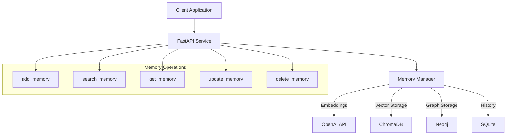
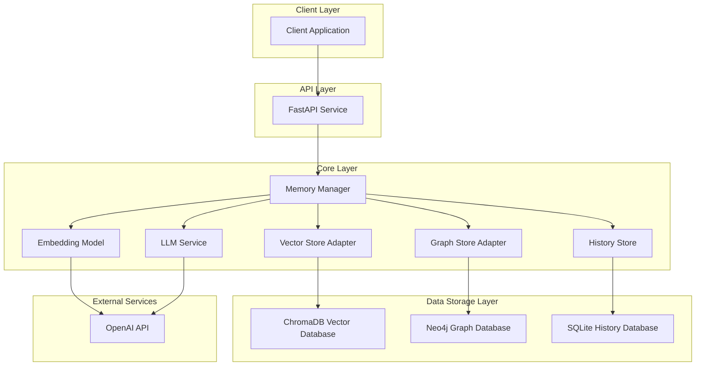
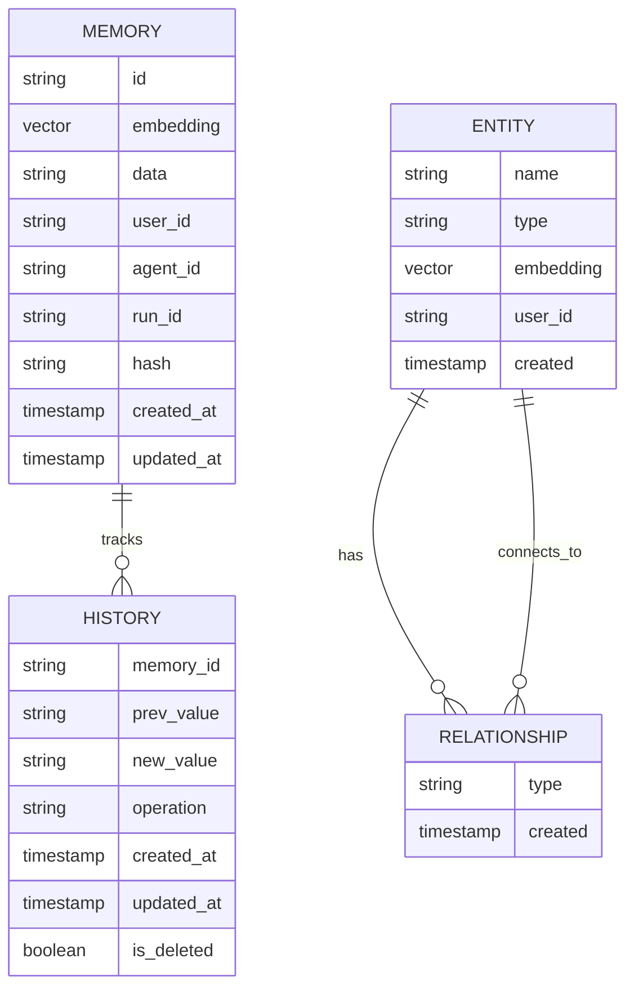
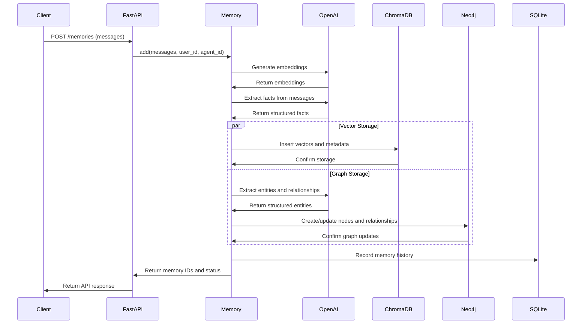
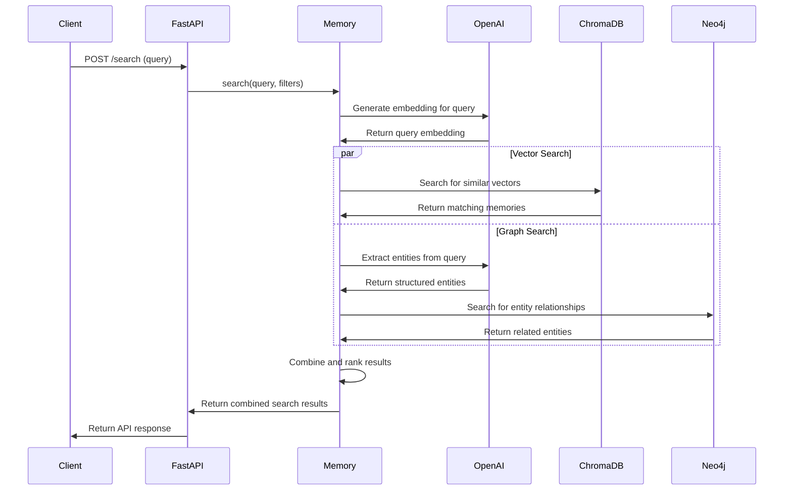
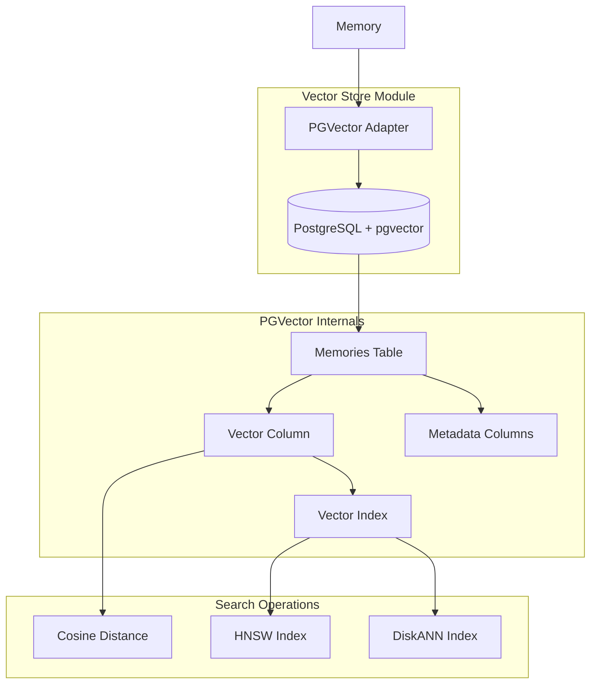
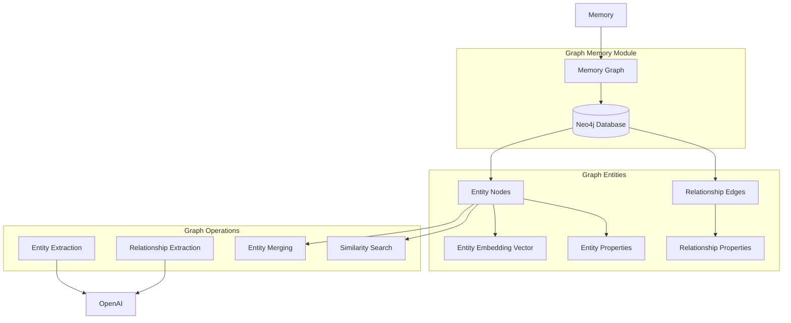
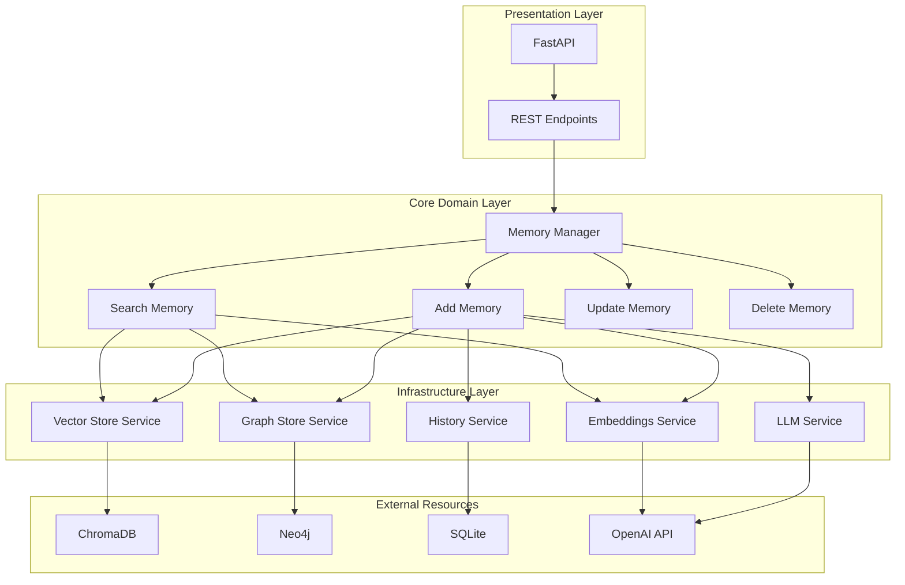

# Mem0 MCP Server Architecture Diagrams

## System Architecture Diagram

## C4 Component Diagram

## Database Schema

## add_memory Flow

## search_memory Flow

## Vector Store Architecture (PGVector Variant)

## Neo4j Graph Memory

## System Layered Architecture

