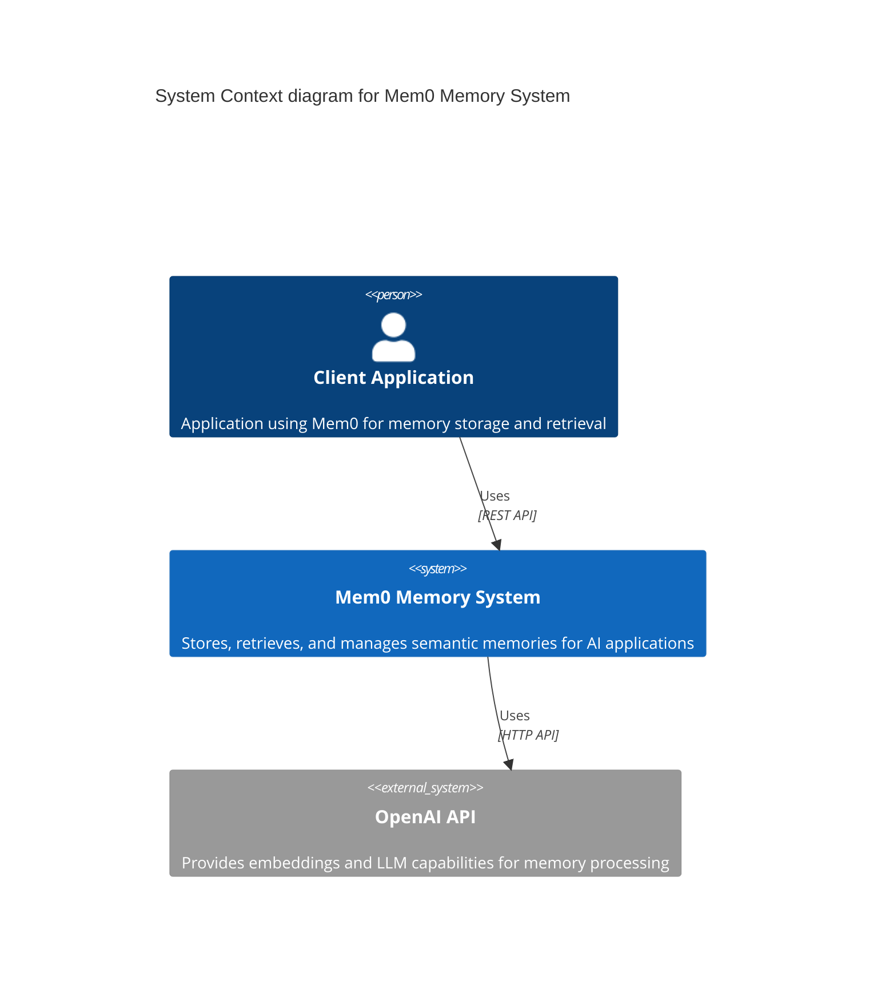
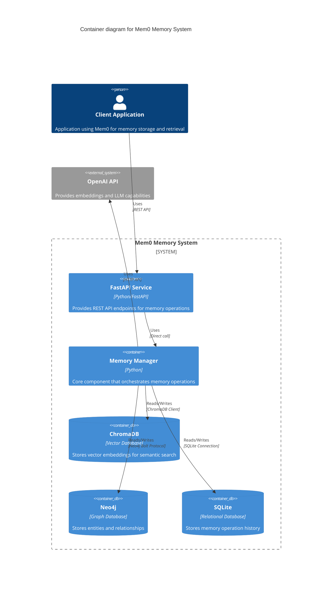
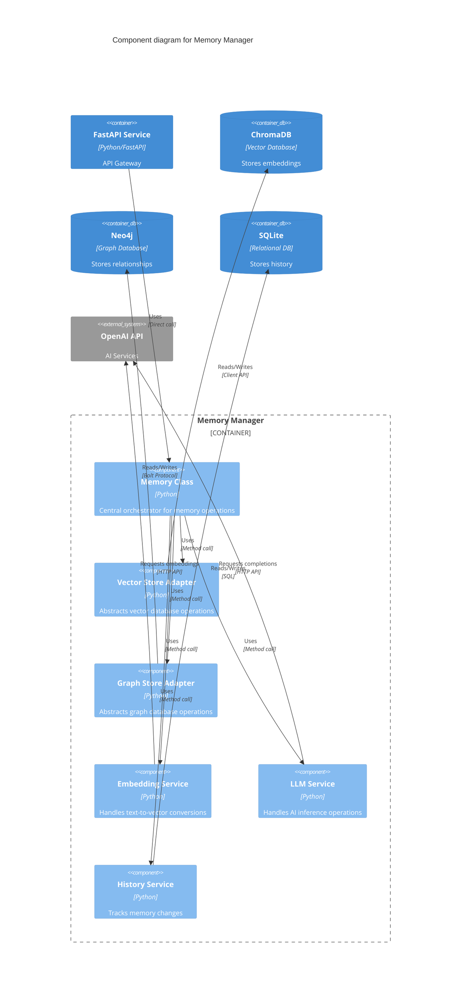
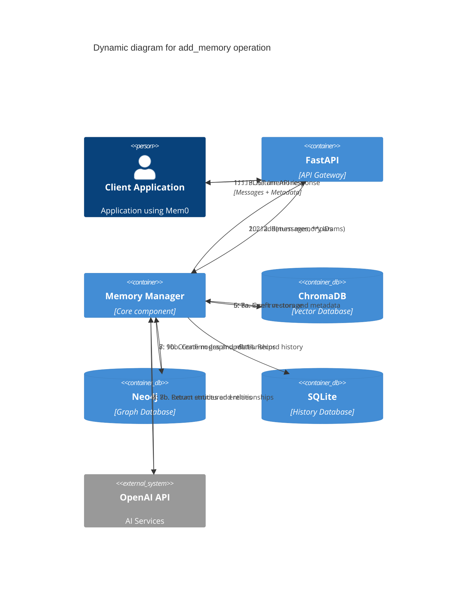
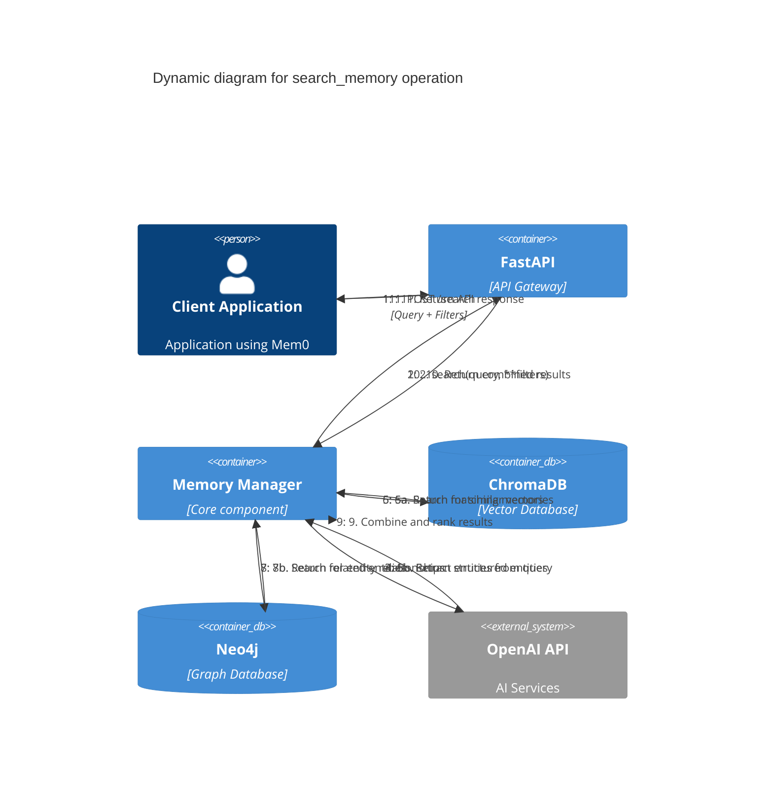
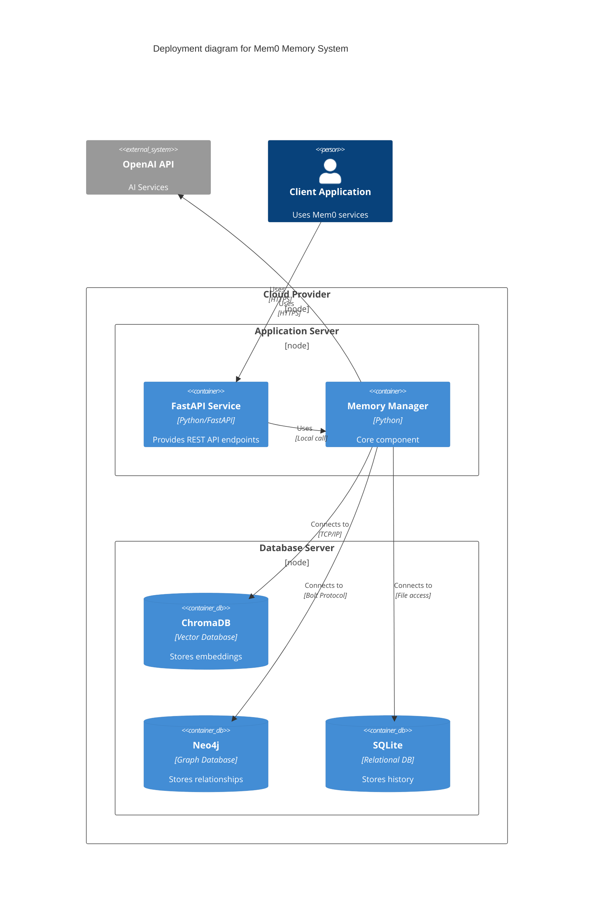

# C4 Models for Mem0 Architecture

## C4 Context Diagram

## C4 Container Diagram

## C4 Component Diagram (Memory Manager)

## C4 Code Diagram (add_memory)

## C4 Dynamic Diagram (search_memory)

## C4 Deployment Diagram

